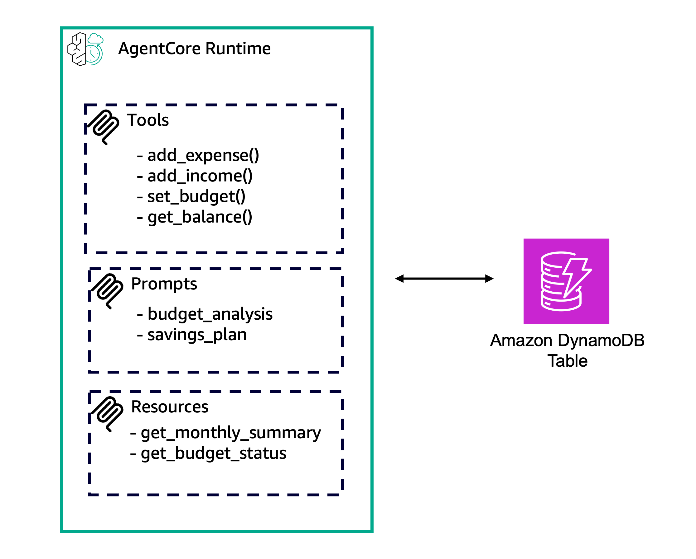

# Full Example of MCP Stateless Server

## Overview

This tutorial demonstrates how to build a complete MCP (Model Context Protocol) server with all three core capabilities and deploy it to Amazon Bedrock AgentCore Runtime.

The [MCP spec](https://modelcontextprotocol.io/specification/2025-11-25/server) defines the building blocks for adding context to language models via MCP. These operations enable rich interactions between clients, servers, and language models:
- **Prompts**: Pre-defined templates or instructions that guide language model interactions
- **Resources**: Structured data or content that provides additional context to the model
- **Tools**: Executable functions that allow models to perform actions or retrieve information

## Prerequisites

Before starting this tutorial, ensure you have:
- AWS CLI configured with appropriate permissions
- Python 3.13+ installed
- Jupyter Notebook environment set up
- Access to Amazon Bedrock AgentCore

## Getting Started

To get started with this tutorial, open and follow the step-by-step guide in the Jupyter notebook:

**[📓 01_full_mcp_server_e2e](01_full_mcp_server_e2e.ipynb)**

The notebook contains all the code examples, configurations, and detailed instructions needed to complete this tutorial.

## What You'll Learn

In this tutorial, you will learn:

* How to create an MCP server with tools, prompts and resources
* How to deploy to AgentCore Runtime
* How to invoke your deployed server

### Tutorial Details

| Information         | Details                                                   |
|:--------------------|:----------------------------------------------------------|
| Tutorial type       | Hosting Tools, Prompts and Resources on Runtime           |
| Tool type           | MCP server                                                |
| Tutorial components | Hosting on AgentCore Runtime, Creating an MCP server      |
| Tutorial vertical   | Cross-vertical                                            |
| Example complexity  | Medium                                                    |
| SDK used            | Amazon BedrockAgentCore Python SDK and MCP Client         |

### Tutorial Architecture

In this tutorial, we will describe how to deploy this example to AgentCore Runtime.

In this tutorial notebook, you will build one agent. First, you will deploy the agent on AgentCore Runtime with four tools. Then, you will update it to add prompts. Finally, you will update it again to deploy resources.

### Tutorial Key Features

* Hosting Complete MCP Server (Stateless)
* Using Tools, Resources, and Prompts from the MCP Spec