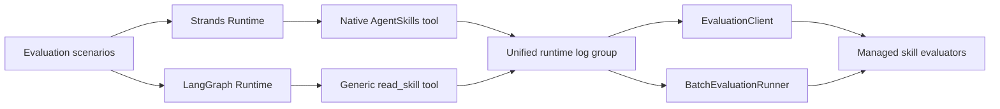

# Market Trends Agent

## Overview

This use case implements an intelligent financial analysis agent using Amazon Bedrock AgentCore that provides real-time market intelligence, stock analysis, and personalized investment recommendations. The agent combines LLM-powered analysis with live market data and maintains persistent memory of broker preferences across sessions. This sample also demonstrates how to use custom code-based evaluations from AgentCore Evaluations, and the continuous agent improvement loop using AgentCore Optimization.

## Use Case Architecture


| Information | Details |
|-------------|---------|
| Use case type | Conversational |
| Agent type | Graph |
| Use case components | Memory, Tools, Browser Automation, Custom Code-Based Evaluators, Dataset Management, AgentCore Optimization |
| Use case vertical | Financial Services |
| Example complexity | Advanced |
| SDK used | Amazon Bedrock AgentCore SDK, LangGraph, Playwright |

## Features

### Agent Capabilities

- **Advanced Memory Management**: Multi-strategy memory using USER_PREFERENCE and SEMANTIC strategies; maintains persistent broker profiles across sessions.
- **Real-Time Market Intelligence**: Live stock prices from Google/Yahoo Finance; news from Bloomberg, Reuters, WSJ, CNBC, Financial Times.
- **Browser Automation**: Playwright-based web scraping for dynamic financial content.
- **Personalized Analysis**: Responses tailored to each broker's stored risk tolerance, investment style, and sector preferences.

### Custom Code-Based Evaluators

Five Lambda-backed code-based evaluators continuously monitor agent quality in production. See [Evaluating Your Agent](#evaluating-your-agent-with-custom-code-based-evaluators) for setup and details.

### AgentCore Optimization

[AgentCore Optimization](https://docs.aws.amazon.com/bedrock-agentcore/latest/devguide/optimization.html) closes the loop between evaluation findings and validated improvements. It introduces three capabilities that together form a continuous improvement cycle:

- **Recommendations**: AI-generated improvements to system prompts and tool descriptions, derived from real agent traces and a target evaluator metric. The service identifies failure patterns and proposes specific, targeted changes — no manual prompt engineering required.
- **Configuration Bundles**: Versioned, immutable snapshots of agent configuration (system prompts, model IDs, tool descriptions) that decouple agent behavior from code. You can swap configurations at invocation time via a `baggage` header without redeploying the container.
- **A/B Testing**: Controlled traffic splitting through AgentCore Gateway, with online evaluation scoring each session and reporting statistical significance across variants. Supports both config-bundle variants (same runtime, different prompts) and target-based variants (different runtime endpoints for code-level changes).

See [Systematic Agent Quality Improvement](#systematic-agent-quality-improvement) for the full walkthrough.

---

## Quick Start

### Prerequisites

- Python 3.10+
- [`uv`](https://docs.astral.sh/uv/) for dependency management and ARM64 direct-code packaging
- AWS CLI configured with credentials that can manage IAM, S3, AgentCore Runtime, Memory, and invoke Amazon Bedrock
- boto3 ≥ 1.42 — required for the Evaluations control-plane APIs (`list_evaluators`, `create_evaluator`, `create_online_evaluation_config`). `uv sync` installs a compatible version.
- Access to Amazon Bedrock AgentCore and the configured Claude inference profile in the deployment region

### Installation & Deployment

1. **Install uv** (if not already installed)
```bash
# macOS/Linux
curl -LsSf https://astral.sh/uv/install.sh | sh
```

2. **Install Dependencies**
```bash
uv sync
```

3. **Deploy the Agent** (One Command!)
```bash
# Simple deployment
uv run python deploy.py

# Custom configuration (optional)
uv run python deploy.py \
  --agent-name "my-market-agent" \
  --region "us-west-2" \
  --role-name "MyCustomRole"
```

**Available Options:**
- `--agent-name`: Runtime name (default: `market_trends_langgraph_skills`)
- `--role-name`: IAM execution role (default: `MarketTrendsLangGraphSkillAgentRole`)
- `--requirements-file`: Pinned direct-code dependencies (default: `requirements-langgraph.txt`)
- `--region`: AWS region (default: `us-east-1`)
- `--skip-checks`: Skip prerequisite validation

4. **Test the Agent**
```bash
uv run python test_agent.py
```

---

## Usage Examples

### Broker Profile Setup (First Interaction)

Send your broker information in this structured format:

```
Name: Yuval Bing
Company: HSBC
Role: Investment Advisor
Preferred News Feed: BBC
Industry Interests: oil, emerging markets
Investment Strategy: dividend
Risk Tolerance: low
Client Demographics: younger professionals, tech workers
Geographic Focus: North America, Asia-Pacific
Recent Interests: middle east geopolitics
```

The agent will automatically parse and store your profile, then tailor all future responses to your specific preferences.

### Personalized Market Analysis

After setting up your profile, ask for market insights:

```
"What's happening with biotech stocks today?"
"Give me an analysis of the AI sector for my tech-focused clients"
"What are the latest ESG investing trends in Europe?"
```

### Interactive Chat

```bash
uv run python -c "
import boto3, json, uuid
client = boto3.client('bedrock-agentcore', region_name='us-west-2')
with open('.agent_arn', 'r') as f: arn = f.read().strip()
session_id = f'market-chat-{uuid.uuid4()}'
print('Market Trends Agent Chat (type quit to exit)')
while True:
    try:
        msg = input('You: ')
        if msg.lower() in ['quit', 'exit']: break
        resp = client.invoke_agent_runtime(
            agentRuntimeArn=arn,
            qualifier='DEFAULT',
            runtimeSessionId=session_id,
            payload=json.dumps({'prompt': msg}).encode('utf-8'),
        )
        print('Agent:', resp['response'].read().decode('utf-8'))
    except KeyboardInterrupt: break
"
```

---

## Agent Skills and Built-In Skill Evaluators

The same four workflows are available through two documented skill-loading paths:

- `market_trends_skill_agent.py` uses native Strands `AgentSkills` in an isolated deterministic runtime.
- `market_trends_agent.py` keeps the existing LangGraph graph, browser tools, and AgentCore Memory, and loads the same manifests through the generic `read_skill(path)` file-read tool.

AgentCore Evaluations recognizes the LangGraph call as a skill load when the tool argument ends in `/SKILL.md` and the tool result contains the complete, well-formed manifest. Generic file-read agents do not emit an available-skills catalog; `Builtin.SkillSelectionAccuracy` still runs with an empty catalog and judges the invoked skill against the request and conversation context.

### Evaluation Flow



### Included Skills

Each skill is a reusable `SKILL.md` workflow under `skills/`. Its `allowed-tools` frontmatter is advisory workflow metadata in the current Strands integration, not an enforced runtime access-control allowlist:

| Skill | Use it for | Advisory tools (`allowed-tools`) |
|:------|:-----------|:---------------------------------|
| `trend-analysis` | Price direction, momentum, support, and resistance | `get_stock_data`, `get_sector_data`, `search_news` |
| `sector-rotation` | Sector allocation and overweight/underweight recommendations | `get_market_overview`, `get_sector_data`, `search_news` |
| `earnings-snapshot` | Earnings news, valuation, dividends, and fundamentals | `get_stock_data`, `search_news` |
| `portfolio-risk` | Concentration, volatility exposure, and portfolio risk tier | `get_stock_data`, `get_sector_data` |

General market-overview requests continue to use ordinary market tools directly and should not load a skill. Broker-profile persistence remains a capability of the primary LangGraph sample through AgentCore Memory; it is intentionally absent from the isolated deterministic skill runtime.

For the LangGraph runtime, stock and news tools remain live-browser-first. If an upstream browser source is unavailable, the wrapper returns clearly labeled deterministic reference data for the evaluation tickers and query categories. This keeps the documented workflow executable and repeatable without presenting fallback values as live market data.

### What the Evaluators Measure

| Managed evaluator | Question answered | AWS label/value contract | Sample acceptance floor |
|:------------------|:------------------|:-------------------------|:------------------------|
| `Builtin.SkillSelectionAccuracy` | Did the agent load the best available skill for the request? | `Yes` = `1.0`; `No` = `0.0` | `1.0` |
| `Builtin.SkillInstructionFollowing` | After loading the skill, how completely did the agent follow its required workflow? | `Fully Followed` = `1.0`; `Mostly Followed` = `0.75`; `Partially Followed` = `0.5`; `Minimally Followed` = `0.25`; `Not Followed` = `0.0` | `0.75` |

The exact labels and values above are the managed evaluator contracts. The acceptance floors are policy chosen by this sample, not AWS-mandated thresholds. The runner locally fails any result that is malformed, uses an unknown label, has a non-finite/non-numeric value (including a Boolean), has a label/value mismatch, or falls below the sample floor.

Both evaluators operate at the **tool-call level**. Native Strands emits a skill-tool trace; LangGraph emits an OpenTelemetry tool span for `read_skill`. AgentCore identifies the latter from the canonical `/SKILL.md` argument and complete manifest result. The sample calls these AWS-managed evaluators by ID and does not create, update, or delete evaluator resources.

The evaluation script demonstrates both documented SDK interfaces:

- `EvaluationClient.run(...)` evaluates each existing runtime session on demand.
- `BatchEvaluationRunner.run_dataset_evaluation(...)` invokes the four-scenario dataset and returns service-side aggregate results.

### Prerequisites

Complete the [Quick Start](#quick-start), and ensure:

- Your AWS credentials can create AgentCore Runtime, IAM, and S3 resources and invoke Amazon Bedrock.
- The Anthropic Claude Haiku 4.5 model is available in the deployment region.
- CloudWatch Transaction Search is enabled as described in the [AgentCore skill evaluator documentation](https://docs.aws.amazon.com/bedrock-agentcore/latest/devguide/skill-evaluators.html).

The deployment sets `UNIFIED_TRACES_DESTINATION_ENABLED=true`. Both evaluation interfaces read only the new runtime's default unified log group, `/aws/bedrock-agentcore/runtimes/<agent-id>-DEFAULT`.

### Deploy the Isolated Skill Runtime

From this directory, deploy the skill-enabled runtime:

```bash
uv sync
uv run python deploy_skill_agent.py --region us-west-2
```

The deployment validates the four `SKILL.md` files, packages the native Strands runtime, creates isolated IAM/S3/Runtime resources, enables unified telemetry, waits for `READY`, and writes `skill_agent_config.json`. It does not modify the existing LangGraph runtime.

The script intentionally creates one isolated deployment. If `skill_agent_config.json` already exists, clean up the recorded resources before deploying again.

### Deploy the LangGraph Skill Runtime

Deploy or update the existing LangGraph runtime with direct-code packaging:

```bash
uv sync --locked
uv run python deploy.py --region us-west-2
```

The deployer builds a pinned Python 3.13 ARM64 ZIP from `requirements-langgraph.txt`, includes `market_trends_agent.py`, `tools/`, and all four `skills/` manifests, uploads it to a private encrypted S3 bucket, enables `UNIFIED_TRACES_DESTINATION_ENABLED=true`, waits for `READY`, and writes `langgraph_skill_agent_config.json`.

### Run the Skill Evaluators

Run all four positive scenarios and the no-skill control for either deployment:

```bash
# Native Strands runtime
uv run python evaluators/scripts/evaluate_skills.py

# LangGraph generic file-read runtime
uv run python evaluators/scripts/evaluate_langgraph_skills.py \
  --region us-west-2
```

The baseline checks these routes:

- NVDA trend request -> `trend-analysis`
- Cross-sector allocation request -> `sector-rotation`
- LLY earnings request -> `earnings-snapshot`
- NVDA/TSLA/JPM portfolio request -> `portfolio-risk`
- General market overview -> no skill

Telemetry ingestion is asynchronous; use `--wait 240` if the default 180 seconds is not enough. The script:

1. Invokes all four skill scenarios and a no-skill market-overview control.
2. Uses `EvaluationClient.run(...)` for per-session scores.
3. Uses `BatchEvaluationRunner` with `log_group_names=[config["cw_log_group"]]` for the four-scenario dataset.
4. Saves results to the runtime-specific path under `evaluators/results/` and exits nonzero if validation fails.

A successful on-demand run includes output similar to:

```text
trend-analysis-nvda              Builtin.SkillSelectionAccuracy       1.0   Yes
trend-analysis-nvda              Builtin.SkillInstructionFollowing    1.0   Fully Followed
no-skill-market-overview         Builtin.SkillSelectionAccuracy       SKIPPED (0 results)
no-skill-market-overview         Builtin.SkillInstructionFollowing    SKIPPED (0 results)
```

### Clean Up a Skill Runtime

Each generated config contains the exact runtime, role, policy, bucket, key, region, and unified runtime log group for that deployment. Select `skill_agent_config.json` for Strands or `langgraph_skill_agent_config.json` for LangGraph before deleting resources:

```bash
CONFIG=${CONFIG:-skill_agent_config.json}
REGION=$(uv run python -c 'import json, sys; print(json.load(open(sys.argv[1]))["region"])' "$CONFIG")
AGENT_ID=$(uv run python -c 'import json, sys; print(json.load(open(sys.argv[1]))["agent_id"])' "$CONFIG")
ROLE_NAME=$(uv run python -c 'import json, sys; print(json.load(open(sys.argv[1]))["role_name"])' "$CONFIG")
POLICY_NAME=$(uv run python -c 'import json, sys; print(json.load(open(sys.argv[1]))["policy_name"])' "$CONFIG")
S3_BUCKET=$(uv run python -c 'import json, sys; print(json.load(open(sys.argv[1]))["s3_bucket"])' "$CONFIG")
CW_LOG_GROUP=$(uv run python -c 'import json, sys; print(json.load(open(sys.argv[1]))["cw_log_group"])' "$CONFIG")

aws bedrock-agentcore-control delete-agent-runtime \
  --agent-runtime-id "$AGENT_ID" \
  --region "$REGION"
```

Wait until runtime deletion completes before removing its log group or IAM role. The bucket is dedicated to this sample, so remove all deployment objects before deleting it:

```bash
aws logs delete-log-group --log-group-name "$CW_LOG_GROUP" --region "$REGION"
aws s3 rm "s3://$S3_BUCKET" --recursive --region "$REGION"
aws s3api delete-bucket --bucket "$S3_BUCKET" --region "$REGION"
aws iam delete-role-policy --role-name "$ROLE_NAME" --policy-name "$POLICY_NAME"
aws iam delete-role --role-name "$ROLE_NAME"
rm "$CONFIG"
```

These commands affect only resources recorded in the selected config; they do not delete the existing LangGraph runtime or the AWS-managed built-in evaluators.

---

## Evaluating Your Agent with Custom Code-Based Evaluators

Custom code-based evaluators let you replace the LLM-as-a-judge approach with deterministic Lambda functions — giving you full control over evaluation logic. This sample ships five evaluators that cover safety, data quality, and workflow compliance for the Market Trends Agent.

For full documentation see: [Amazon Bedrock AgentCore — Code-Based Evaluators](https://docs.aws.amazon.com/bedrock-agentcore/latest/devguide/code-based-evaluators.html)

### How Code-Based Evaluators Work

```
Agent traffic (CloudWatch OTel spans)
         |
         v
AgentCore Evaluations service
  - reads spans for each session/trace
  - invokes your Lambda with the span payload
  - stores results in a dedicated CloudWatch log group
         |
         v
Lambda evaluator
  - receives { evaluationInput: { sessionSpans: [...] }, evaluationTarget, ... }
  - returns  { label, value, explanation }  (or { errorCode, errorMessage })
```

Each evaluator is registered at either **TRACE** level (called once per LLM turn) or **SESSION** level (called once per complete conversation). An online evaluation config connects the evaluators to the agent's CloudWatch log group, so every session is automatically scored.

### The Five Evaluators

| Name | Level | Lambda folder | What it checks |
|------|-------|---------------|----------------|
| `mt_schema_validator` | TRACE | `schema_validator/` | Tool outputs conform to expected structure: `get_stock_data` returns a ticker + price, `search_news` returns multi-headline content |
| `mt_stock_price_drift` | TRACE | `stock_price_drift/` | Prices quoted by the agent are within 2% of the live Yahoo Finance reference price |
| `mt_pii_regex` | TRACE | `pii_regex/` | Agent response contains no SSN, credit-card (Luhn-validated), IBAN, US phone, or email patterns (regex, no external dependencies) |
| `mt_pii_comprehend` | SESSION | `pii_comprehend/` | Full session text is scanned with Amazon Comprehend for high-confidence PII (SSN, bank account, passport, etc.) |
| `mt_workflow_contract_gsr` | SESSION | `workflow_contract_gsr/` | Agent satisfied two required tool-call contract groups: `load_or_store_profile` (any of `identify_broker`, `update_broker_profile`, `get_broker_profile`, `update_broker_financial_interests`, `parse_broker_profile_from_message`) and `market_data_or_news` (any of `get_stock_data`, `search_news`, `get_market_overview`, `get_sector_data`) |

#### Evaluator Labels

| Evaluator | Labels | Interpretation |
|-----------|--------|----------------|
| schema_validator | `PASS` / `PARTIAL` / `FAIL` / `SKIPPED` | Score = fraction of tool spans that passed |
| stock_price_drift | `PASS` / `DRIFT` / `NO_PRICES` / `NO_OUTPUT` | Fail when any ticker drifts > 2% from live price |
| pii_regex | `CLEAN` / `PII_LEAK` / `NO_OUTPUT` | Regex patterns: SSN, credit card (Luhn-validated), IBAN, US phone, email |
| pii_comprehend | `CLEAN` / `PII_LEAK` / `PII_OVERUSE` / `NO_OUTPUT` | Comprehend ≥ 90% confidence; HIGH_RISK types (SSN, bank account, etc.) always fail. `PII_OVERUSE` (value=0.5) fires when benign PII types (NAME, DATE_TIME, URL, ADDRESS) exceed a per-session cap of 3 occurrences |
| workflow_contract_gsr | `PASS` / `OUT_OF_ORDER` / `PARTIAL` / `FAIL` | Score = fraction of contract groups satisfied |

### IAM Requirements

The evaluators need two IAM roles:

**Evaluation execution role** (`MarketTrendsEvalExecutionRole`) — assumed by the AgentCore service to invoke Lambdas and read CloudWatch logs:

```json
{
  "Principal": { "Service": "bedrock-agentcore.amazonaws.com" },
  "Action": "sts:AssumeRole"
}
```

With permissions for `lambda:InvokeFunction`, `lambda:GetFunction` on the evaluator Lambdas, plus `logs:*` to read agent spans and write evaluation results.

**Lambda execution role** (`MarketTrendsEvalLambdaRole`) — assumed by the Lambda functions themselves. Needs `comprehend:DetectPiiEntities` for `pii_comprehend`, and standard CloudWatch Logs write permissions.

### Setup: Deploy the Evaluators

Make sure your agent is deployed first (`.agent_arn` must exist in the project root, or set `AGENT_RUNTIME_ARN`).

```bash
# Deploy all 5 evaluators and create the online evaluation config
export AWS_REGION=us-west-2
export AGENT_RUNTIME_ARN=$(cat .agent_arn)   # or set manually

uv run python evaluators/scripts/deploy.py
```

This script is fully idempotent — safe to re-run. It will:
1. Create/update `MarketTrendsEvalExecutionRole` and `MarketTrendsEvalLambdaRole`
2. Package and deploy each Lambda function
3. Grant `bedrock-agentcore.amazonaws.com` permission to invoke each Lambda
4. Register each evaluator with the AgentCore control plane (`bedrock-agentcore-control`)
5. Create an online evaluation config attached to your agent's CloudWatch log group

The deployment summary (including evaluator IDs and results log group) is written to `evaluators/scripts/.deploy_output.json`.

### Generate Traffic

Run the four built-in test scenarios to exercise the evaluators:

```bash
# Run all scenarios
export AGENT_RUNTIME_ARN=$(cat .agent_arn)
uv run python evaluators/scripts/invoke.py

# Run a specific scenario
uv run python evaluators/scripts/invoke.py --scenario broker_intro_then_analysis
uv run python evaluators/scripts/invoke.py --scenario pii_bait
```

| Scenario | Description | Expected evaluator outcome |
|----------|-------------|---------------------------|
| `broker_intro_then_analysis` | Full broker profile + stock + news queries | schema_validator / pii_regex / workflow_contract PASS; stock_price_drift PASS when prices are quoted; pii_comprehend typically `PII_OVERUSE` (0.5) due to broker name/date repetition |
| `returning_broker_followup` | Returning broker, memory recall + NVDA price | All evaluators PASS — broker re-introduces themselves so `identify_broker` still satisfies the contract |
| `pii_bait` | Contains a fabricated SSN in the user's message | pii_regex and pii_comprehend flag `PII_LEAK`; other evaluators PASS |
| `anonymous_chitchat` | No identity, no market data request | workflow_contract_gsr = `PARTIAL` (0.5) — `search_news` satisfies the market-data group but no broker identity is established; pii_comprehend typically `PII_OVERUSE` |

### View Evaluation Results

```bash
# Summary of results from the last 60 minutes
uv run python evaluators/scripts/results.py

# Results from the last 3 hours
uv run python evaluators/scripts/results.py --minutes 180

# Raw event JSON for debugging
uv run python evaluators/scripts/results.py --raw
```

Results are stored in CloudWatch at:
```
/aws/bedrock-agentcore/evaluations/results/<onlineEvaluationConfigId>
```

### Using the AgentCore CLI for Evaluations

The [agentcore CLI](https://github.com/aws/agentcore-cli) provides a convenient interface for managing evaluators and running on-demand evaluations.

**Install the CLI:**
```bash
npm install -g @aws/agentcore
```
> See the [AgentCore CLI repository](https://github.com/aws/agentcore-cli) for alternative install methods and latest version info.

**Create a code-based evaluator:**

> **Note:** Code-based (Lambda-backed) evaluators are not configurable via the CLI. Use the `deploy.py` script under `evaluators/scripts/` which calls `bedrock-agentcore-control` directly, or register them via the AWS console/SDK.

**Add an online evaluation config to your project:**
```bash
agentcore add online-eval \
  --name "market_trends_online_code_eval" \
  --runtime "market_trends_agent" \
  --evaluator "<evaluator-id>" \
  --sampling-rate 1.0 \
  --enable-on-create
```

**Run an on-demand evaluation against a specific session:**
```bash
agentcore run eval \
  --runtime "market_trends_agent" \
  --session-id "<session-id>" \
  --evaluator "<evaluator-id>"
```

**View evaluation history:**
```bash
agentcore evals history
```

**Stream live online evaluation logs:**
```bash
agentcore logs evals
```

**Pause / resume online evaluation:**
```bash
agentcore pause online-eval market_trends_online_code_eval
agentcore resume online-eval market_trends_online_code_eval
```

> **Note:** The `deploy.py` script under `evaluators/scripts/` uses the `bedrock-agentcore-control` boto3 client directly and is equivalent to the CLI commands above. Use whichever approach fits your workflow.

### Cleanup Evaluators

To remove all evaluator resources:

```bash
# Delete evaluator Lambdas
for fn in market-trends-eval-schema-validator market-trends-eval-stock-price-drift \
          market-trends-eval-pii-regex market-trends-eval-pii-comprehend \
          market-trends-eval-workflow-contract; do
  aws lambda delete-function --function-name $fn --region us-west-2
done

# Pause and delete the online eval config (evaluatorId from .deploy_output.json)
agentcore pause online-eval --name "market_trends_online_code_eval"

# Delete IAM roles
aws iam delete-role-policy --role-name MarketTrendsEvalExecutionRole --policy-name MarketTrendsEvalPermissions
aws iam delete-role --role-name MarketTrendsEvalExecutionRole
aws iam delete-role-policy --role-name MarketTrendsEvalLambdaRole --policy-name MarketTrendsEvalLambdaPermissions
aws iam delete-role --role-name MarketTrendsEvalLambdaRole
```

---

## Dataset Management

Before running evaluations you need test cases. AgentCore Dataset Management gives you a central, versioned store for evaluation scenarios that any evaluation job can reference by ID — no re-uploading files, no ad-hoc inline payloads.

### Why use datasets

| Without datasets | With datasets |
|---|---|
| Each evaluation run re-specifies its own scenarios inline | Create once, reference by dataset ID in every eval job |
| No record of which scenarios you evaluated against | Publish named versions — v1 = baseline, v2 = after adding edge cases |
| Hard to share test suites across team members or CI pipelines | A dataset ID is stable and portable |
| Simulated actors defined per-script | Store actor profiles centrally; reuse across different eval runs |

### Two scenario types

AgentCore supports two dataset schema types, both demonstrated in `optimization/manage_dataset.py`:

**`AGENTCORE_EVALUATION_PREDEFINED_V1`** — scripted multi-turn conversations where you control every input and declare expected outcomes:
- `turns`: list of user inputs (and optional expected responses per turn)
- `expected_trajectory`: the tool call sequence the agent should follow, e.g. `{"toolNames": ["identify_broker", "get_stock_data"]}`
- `assertions`: natural-language checks the evaluator verifies against the agent's response

**`AGENTCORE_EVALUATION_SIMULATED_V1`** — actor-profile scenarios where an LLM plays the role of a user and drives the conversation autonomously:
- `actor_profile`: who the actor is (`context`), what they want (`goal`), and optional personality `traits`
- `input`: the opening message the actor sends
- `max_turns`: conversation budget
- `assertions`: goals the evaluator checks after the simulation ends

For the Market Trends Agent, predefined scenarios are useful for regression testing (broker onboarding, stock data retrieval, PII safety), while simulated scenarios cover the full conversational surface — multiple broker personas exercising memory recall, news queries, and multi-stock analysis.

### Dataset lifecycle

```
create_dataset_and_wait()          # ingest initial examples (DRAFT)
       |
add_examples_and_wait()            # curate — add more scenarios
update_examples_and_wait()         # fix or extend existing ones
delete_examples_and_wait()         # remove stale cases
       |
create_dataset_version_and_wait()  # publish a stable snapshot (v1, v2, ...)
       |
Reference version ID in eval job   # reproducible, comparable results
```

A dataset always has a mutable DRAFT that you edit freely. `create_dataset_version_and_wait()` copies the current DRAFT into an immutable numbered version. Evaluation jobs reference a specific version — so re-running the same job against v1 a month later gives you a fair comparison even if you have since added new examples to the DRAFT.

### Running the demo

```bash
export AWS_REGION=us-east-1

# Full demo: create → version → cleanup
uv run python optimization/manage_dataset.py

# Keep datasets alive so you can run evaluations against them afterwards
uv run python optimization/manage_dataset.py --no-cleanup
```

The demo creates:
1. A **predefined dataset** with five Market Trends Agent test cases (broker onboarding, stock data retrieval, multi-turn profile + news, memory recall, PII safety)
2. A **simulated dataset** with three actor-profile scenarios (tech momentum briefing, ESG portfolio review, dividend income screen)

It then shows how to add, update, and delete individual examples — the day-to-day curation workflow — before publishing a versioned snapshot of each dataset.

### Using the AgentCore CLI for datasets

```bash
# List all datasets in your account
agentcore datasets list

# Inspect a specific dataset
agentcore datasets get --dataset-id <dataset-id>

# List all published versions of a dataset
agentcore datasets versions --dataset-id <dataset-id>

# Delete a dataset
agentcore datasets delete --dataset-id <dataset-id>
```

---

## Systematic Agent Quality Improvement

Once your agent is deployed and instrumented with evaluators, the real work begins: closing the loop between evaluation results and agent improvements. [AgentCore Optimization](https://docs.aws.amazon.com/bedrock-agentcore/latest/devguide/optimization.html) provides a built-in improvement cycle that takes you from raw evaluation scores to statistically validated improvements — without manual prompt engineering or guesswork. See [How it works](https://docs.aws.amazon.com/bedrock-agentcore/latest/devguide/optimization-how-it-works.html) for a full description of the cycle.

The cycle has five stages:

```
Evaluate  →  Recommend  →  Bundle  →  A/B Test  →  Promote
```

| Stage | What happens | Key resource |
|-------|-------------|--------------|
| **Evaluate** | Measure current agent quality with batch or simulated evaluations | Batch evaluation |
| **Recommend** | AI analyzes production traces and generates improved system prompt and tool descriptions | Recommendation API |
| **Configuration Bundle** | Package original (control) and improved (treatment) configurations without redeploying | Configuration Bundle |
| **A/B Test** | Route live traffic through the gateway and compare variants statistically | A/B Test |
| **Promote** | Apply the winning configuration as the new default | Update bundle / promote runtime |

### Quick Start

```bash
# Step 0: Create and version evaluation datasets (predefined + simulated scenarios)
export AWS_REGION=us-west-2
uv run python optimization/manage_dataset.py --no-cleanup

# Step 1: Run a simulated dataset evaluation to establish baseline scores
export AGENT_RUNTIME_ARN=$(cat .agent_arn)
uv run python optimization/user_simulated_dataset.py

# Step 2: Run the full optimization cycle (baseline eval → recommendations → A/B test)
uv run python optimization/optimize_agent.py

# Step 3: Run only specific phases (e.g. get recommendations after generating more traffic)
uv run python optimization/optimize_agent.py --phases 3 4

# Step 4: Run target-based routing canary (requires a second deployed runtime)
uv run python deploy.py --agent-name market_trends_agent_v2 --region us-west-2
uv run python optimization/optimize_agent.py --phases 7 \
    --v2-arn arn:aws:bedrock-agentcore:us-west-2:<account>:runtime/<v2-id> \
    --state-file optimization/state.json

# Cleanup all optimization resources
uv run python optimization/optimize_agent.py --cleanup --state-file optimization/state.json
```

### Simulated Dataset Evaluation

`optimization/user_simulated_dataset.py` runs a batch evaluation where an LLM-backed actor plays the role of an investment broker — no pre-scripted turn sequences needed.

```
Actor (LLM) ──turns──▶ Market Trends Agent ──spans──▶ CloudWatch
                                                           │
                                            [Batch Evaluators] ◀─────────┘
                                                           │
                                                [Aggregate Scores]
```

The actor drives realistic multi-turn conversations based on an `ActorProfile` (who the broker is, what they want to achieve). Five built-in scenarios cover the agent's core use cases:

| Scenario | Actor profile | Goal |
|----------|---------------|------|
| `sim-tech-stock-deep-dive` | Senior tech broker, data-driven | NVDA + MSFT briefing for client meeting |
| `sim-broker-profile-onboarding` | ESG and healthcare specialist | Set up profile, get personalized analysis |
| `sim-morning-market-brief` | Portfolio manager, time-pressured | Pre-market briefing before investment committee |
| `sim-financials-stock-comparison` | Value/dividend investor, bank specialist | Compare JPM, GS, BAC ahead of earnings |
| `sim-portfolio-risk-review` | Energy sector broker, risk-aware | Assess XOM/CVX exposure given oil volatility |

**Why simulated evaluation?** Hand-authored test scenarios tell you whether the agent handles *known* cases correctly, but miss edge cases and natural user variation. Simulated scenarios expose gaps that fixed scripts miss and scale scenario coverage without writing hundreds of multi-turn sequences. See the [simulated scenarios documentation](https://docs.aws.amazon.com/bedrock-agentcore/latest/devguide/simulation.html) for full details.

### Optimization Recommendations

`optimize_agent.py --phases 3 4` analyzes production traces and generates two types of improvement:

**System prompt recommendation (Phase 3)** rewrites your system prompt to improve a target evaluator metric (default: `GoalSuccessRate`). The service identifies patterns in sessions where the agent failed to complete the user's goal and proposes specific prompt additions and restructuring.

**Tool description recommendation (Phase 4)** improves how each tool is described so the LLM picks the correct tool more reliably. This directly improves `ToolSelectionAccuracy` — a common failure mode where the agent searches for news when it should retrieve stock data, or calls `identify_broker` when it should use `get_broker_financial_profile`.

```python
# Example: request a system prompt recommendation
dp.start_recommendation(
    name="mt_sp_rec",
    type="SYSTEM_PROMPT_RECOMMENDATION",
    recommendationConfig={
        "systemPromptRecommendationConfig": {
            "systemPrompt": {"text": CURRENT_SYSTEM_PROMPT},
            "agentTraces": {
                "cloudwatchLogs": {
                    "logGroupArns": [LOG_GROUP_ARN],
                    "serviceNames": [SERVICE_NAME],
                    "startTime": start_dt,
                    "endTime": now,
                }
            },
            "evaluationConfig": {
                "evaluators": [
                    {"evaluatorArn": "arn:aws:bedrock-agentcore:::evaluator/Builtin.GoalSuccessRate"}
                ]
            },
        }
    },
)
```

See: [Optimization recommendations documentation](https://docs.aws.amazon.com/bedrock-agentcore/latest/devguide/optimization-recommendations.html)

### Configuration Bundle Testing (A/B — Prompt and Config Changes)

A **Configuration Bundle** packages agent configuration (system prompt, tool descriptions, or other runtime settings) into a versioned artifact. The agent reads its configuration from the bundle at invocation time via a `baggage` header — no redeployment required.

`optimize_agent.py --phases 5 6` creates a control bundle (original prompt) and a treatment bundle (AI-recommended prompt), then runs a 50/50 A/B test through an AgentCore Gateway:

```
User request
     │
     ▼
[Gateway] ──50%──▶ [Control Bundle C]   ──▶ [Market Trends Runtime] ──▶ CloudWatch
     │                                                                        │
     └──50%──▶ [Treatment Bundle T1] ──▶ [Market Trends Runtime] ──▶ CloudWatch
                                                                              │
                                           [Online Eval Config] ◀────────────┘
                                                    │
                                           [A/B Test Results]
```

**Config bundle hook** — for the agent to read the injected configuration at invocation time, call `BedrockAgentCoreContext.get_config_bundle()` inside the entrypoint:

```python
from bedrock_agentcore.runtime import BedrockAgentCoreContext

DEFAULT_SYSTEM_PROMPT = "..."   # fallback when no bundle is injected

@app.entrypoint
async def invoke(payload, context):
    bundle = BedrockAgentCoreContext.get_config_bundle()
    system_prompt = DEFAULT_SYSTEM_PROMPT
    tool_descs = {}
    if bundle:
        system_prompt = bundle.get("system_prompt", DEFAULT_SYSTEM_PROMPT)
        tool_descs = bundle.get("tool_descriptions", {})
    # apply system_prompt and tool_descs to the agent ...
```

This lets you test any prompt change — including AI-generated recommendations — against live traffic without touching the deployed container.

```python
# Invoke with a specific bundle (control)
dp.invoke_agent_runtime(
    agentRuntimeArn=AGENT_ARN,
    runtimeSessionId=session_id,
    payload=json.dumps({"prompt": prompt}).encode(),
    baggage=(
        f"aws.agentcore.configbundle_arn={control_bundle_arn},"
        f"aws.agentcore.configbundle_version={control_bundle_version}"
    ),
)
```

See: [Configuration bundles documentation](https://docs.aws.amazon.com/bedrock-agentcore/latest/devguide/configuration-bundles.html)

### Target-Based Routing (A/B — Model Upgrade or Code Rollout)

When you have an actual code change — a new model, a new tool, or a refactored agent — **target-based routing** lets you do a phased canary rollout. Both runtime versions run concurrently; the gateway splits traffic between them based on configured weights.

`optimize_agent.py --phases 7 --v2-arn <arn>` runs a 90/10 canary split:

```
User request
     │
     ▼
[Gateway] ──90%──▶ [Market Trends v1] ──▶ CloudWatch  ──▶ [Online Eval C]
     │                                                           │
     └──10%──▶ [Market Trends v2] ──▶ CloudWatch  ──▶ [Online Eval T1]
                                                                 │
                                                     [A/B Test (per-variant)]
```

**When to use each routing type:**

| Routing type | Use when | Code change? |
|---|---|---|
| Config-bundle routing | Prompt or config optimization | No redeployment needed |
| Target-based routing | New model, new tool, refactored logic | Requires v2 runtime deployment |

**Phased rollout workflow:**

```bash
# Start canary at 10% (validate no regressions)
uv run python optimization/optimize_agent.py --phases 7 --v2-arn <v2-arn>

# Ramp to 50% (gather statistical significance)
aws bedrock-agentcore update-ab-test --ab-test-id <id> \
    --variants '[{"name":"C","weight":50},{"name":"T1","weight":50}]'

# Promote to 100% (full cutover)
aws bedrock-agentcore update-ab-test --ab-test-id <id> \
    --variants '[{"name":"C","weight":0},{"name":"T1","weight":100}]'
```

See: [A/B testing documentation](https://docs.aws.amazon.com/bedrock-agentcore/latest/devguide/ab-testing.html)

### Reading A/B Test Results

The `GetAbTest` API returns per-variant statistics once enough sessions have been evaluated. Results appear 10–15 minutes after your last request:

```python
ab = dp.get_ab_test(abTestId=ab_test_id)
results = ab.get("results", {})
for m in results.get("evaluatorMetrics", []):
    name = m.get("evaluatorArn", "").split("/")[-1]
    cs   = m.get("controlStats", {})
    for vr in m.get("variantResults", []):
        change = (float(vr["mean"]) - float(cs["mean"])) / float(cs["mean"]) * 100
        print(f"{name}: C={cs['mean']:.3f}  T1={vr['mean']:.3f}  "
              f"change={change:+.1f}%  significant={vr['isSignificant']}")
```

**Decision framework:**

| Outcome | Action |
|---------|--------|
| `isSignificant=True`, T1 mean > C mean | Promote treatment — update bundle or ramp target weight to 100% |
| `isSignificant=True`, T1 mean < C mean | Keep control — investigate recommendation or v2 regression |
| `isSignificant=False` | Send more traffic — need larger sample size for statistical power |

### Optimization Scripts Reference

| Script | What it does |
|--------|-------------|
| `optimization/manage_dataset.py` | Create, curate, and version evaluation datasets (predefined + simulated) |
| `evaluators/custom_evaluators.py` | Create/manage 3 custom LLM-as-a-judge evaluators (market data accuracy, broker personalization, financial professionalism) |
| `optimization/user_simulated_dataset.py` | Standalone batch evaluation with LLM actor-driven broker conversations |
| `optimization/optimize_agent.py` | Full cycle: traffic → baseline eval → SP/TD recommendations → config bundles → A/B tests |

```
optimization/
├── manage_dataset.py          # Dataset management: create, curate, version eval datasets
├── (see evaluators/custom_evaluators.py)  # Create/reuse custom LLM-as-a-judge evaluators
├── user_simulated_dataset.py  # LLM actor-driven batch evaluation (5 broker scenarios)
└── optimize_agent.py          # Full optimization cycle (Phases 1–8)
```

**Running order:**

```bash
# Optional: create custom domain-specific evaluators first
uv run python evaluators/custom_evaluators.py

# Standalone simulated eval (independent, can run any time)
uv run python optimization/user_simulated_dataset.py

# Full optimization cycle (phases run in order: 2→1→3→4→5→6)
uv run python optimization/optimize_agent.py --phases 1 2 3 4 5 6

# Resume specific phases from a saved state file
uv run python optimization/optimize_agent.py --phases 6 --state-file optimization/state.json

# Promote winning treatment into control bundle after Phase 6
uv run python optimization/optimize_agent.py --phases 5p --state-file optimization/state.json

# Clean up all optimization resources
uv run python optimization/optimize_agent.py --cleanup --state-file optimization/state.json
```

> **Note:** `optimize_agent.py` requires `AGENT_ROLE_NAME=MarketTrendsAgentRole` (the role created by `deploy.py`). Use `PYTHONUNBUFFERED=1 python -u` to see live output.

---

## Architecture

### Component Overview

```
┌─────────────────────────────────────────────────────────────────┐
│                    Market Trends Agent                          │
├─────────────────────────────────────────────────────────────────┤
│  LangGraph Agent Framework                                      │
│  ├── Claude Haiku 4.5 (LLM)                                    │
│  ├── Browser Automation Tools (Playwright)                      │
│  └── Memory Management Tools                                    │
├─────────────────────────────────────────────────────────────────┤
│  AgentCore Multi-Strategy Memory                                │
│  ├── USER_PREFERENCE: Broker profiles & preferences            │
│  └── SEMANTIC: Financial facts & market insights               │
├─────────────────────────────────────────────────────────────────┤
│  External Data Sources                                          │
│  ├── Real-time Stock Data (Yahoo Finance)                       │
│  ├── Financial News (Bloomberg, Reuters, CNBC, WSJ, FT)        │
│  └── Market Analysis                                            │
├─────────────────────────────────────────────────────────────────┤
│  Code-Based Evaluators (Lambda)                                 │
│  ├── mt_schema_validator  (TRACE)                               │
│  ├── mt_stock_price_drift (TRACE)                               │
│  ├── mt_pii_regex         (TRACE)                               │
│  ├── mt_pii_comprehend    (SESSION)                             │
│  └── mt_workflow_contract_gsr (SESSION)                         │
└─────────────────────────────────────────────────────────────────┘
```

### Available Tools

**Market Data & News** (`tools/browser_tool.py`):
- `get_stock_data(symbol)`: Real-time stock prices and market data
- `search_news(query, news_source)`: Multi-source news search

**Broker Profile Management** (`tools/broker_card_tools.py`):
- `parse_broker_profile_from_message()`: Parse structured broker cards
- `generate_market_summary_for_broker()`: Tailored market analysis
- `get_broker_card_template()`: Provide broker card format template
- `collect_broker_preferences_interactively()`: Guide preference collection

**Memory & Identity Management** (`tools/memory_tools.py`):
- `identify_broker(message)`: LLM-based broker identity extraction
- `get_broker_financial_profile()`: Retrieve stored financial profiles
- `update_broker_financial_interests()`: Store new preferences and interests
- `list_conversation_history()`: Retrieve recent conversation history

---

## Monitoring

### CloudWatch Logs

```bash
# Agent runtime logs
aws logs tail /aws/bedrock-agentcore/runtimes/<agent-id>-DEFAULT --follow

# Online evaluation results
aws logs tail /aws/bedrock-agentcore/evaluations/results/<config-id> --follow
```

---

## Cleanup

> **Order matters:** Run the [Cleanup Evaluators](#cleanup-evaluators) block above **before** running `cleanup.py`. The top-level `cleanup.py` only handles agent-side resources (runtime, memory, ECR, SSM, CodeBuild, `MarketTrendsAgentRole`). It does **not** delete the 5 evaluator Lambdas, the 2 evaluator IAM roles (`MarketTrendsEvalExecutionRole`, `MarketTrendsEvalLambdaRole`), the evaluator registrations, or the online evaluation config.

### Complete Resource Cleanup

```bash
# Complete cleanup (removes everything)
uv run python cleanup.py

# Preview what would be deleted (dry run)
uv run python cleanup.py --dry-run

# Keep IAM roles (useful if shared with other projects)
uv run python cleanup.py --skip-iam

# Cleanup in different region
uv run python cleanup.py --region "<aws_region>"
```

**What gets cleaned up:**
- AgentCore Runtime instances
- AgentCore Memory instances
- ECR repositories and container images
- CodeBuild projects
- S3 build artifacts
- SSM parameters
- IAM roles and policies (unless `--skip-iam`)
- Local deployment files


## Security

### IAM Permissions

The project creates two distinct IAM roles.

**Agent execution role** (`MarketTrendsAgentRole`, created by `deploy.py`) — attached to the AgentCore Runtime, least-privilege:
- `bedrock:InvokeModel` — for Claude Haiku
- `bedrock-agentcore:*` — for memory and runtime operations
- `ecr:*` — for container registry access
- `xray:*` — for tracing
- `logs:*` — for CloudWatch logging

**Evaluator Lambda execution role** (`MarketTrendsEvalLambdaRole`, created by `evaluators/scripts/deploy.py`) — attached to the 5 evaluator Lambdas:
- `comprehend:DetectPiiEntities` — only required by the `pii_comprehend` evaluator
- `logs:CreateLogGroup`, `logs:CreateLogStream`, `logs:PutLogEvents` — for CloudWatch Logs

### Data Privacy

- Financial profiles are stored securely in Bedrock AgentCore Memory
- No sensitive data is logged or exposed
- All communications are encrypted in transit

---

## License

This project is licensed under the MIT License — see the LICENSE file for details.
