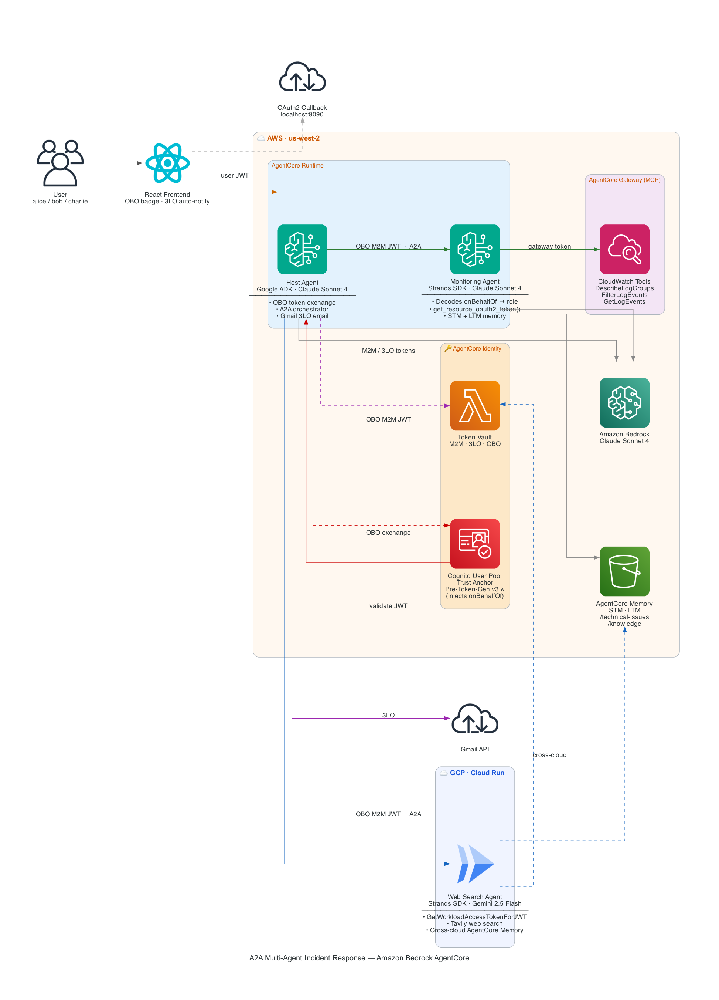

# Agent-to-Agent (A2A) Multi-Agent System on Amazon Bedrock AgentCore for Incident Response

A multi-cloud implementation of the [Agent-to-Agent (A2A)](https://a2a-protocol.org/latest/) protocol using specialized agents running across [Amazon Bedrock AgentCore Runtime](https://docs.aws.amazon.com/bedrock-agentcore/latest/devguide/runtime-a2a.html) and GCP Cloud Run, demonstrating intelligent coordination for AWS infrastructure monitoring and incident response.

The system consists of three agents:

- **Host Agent** ([Google ADK](https://google.github.io/adk-docs/)) — Orchestrates incident response by delegating to specialist agents. Runs on AgentCore Runtime with Claude Sonnet 4 via Amazon Bedrock (LiteLLM). Also handles Gmail 3LO (send email with findings on behalf of the user).
- **Monitoring Agent** ([Strands Agents SDK](https://strandsagents.com/latest/)) — Queries CloudWatch logs, metrics, and alarms via AgentCore Gateway (MCP). Runs on AgentCore Runtime with Claude Sonnet 4.5 via Amazon Bedrock.
- **Web Search Agent** ([Strands Agents SDK](https://strandsagents.com/latest/)) — Searches the web for AWS documentation, best practices, and remediation strategies using Tavily. Runs on GCP Cloud Run with Gemini 2.5 Flash.

All agents communicate via the A2A protocol (JSON-RPC 2.0) and use AgentCore Identity for zero-trust authentication across cloud boundaries. A single Cognito User Pool serves as the trust anchor for M2M tokens, with AgentCore Identity handling token vaulting, JWT validation, and 3LO (Authorization Code Grant) flows.

## Demo


## Architecture Overview



> [!NOTE]
> **Default Models**
>
> This solution uses the following AI models by default:
> - **Host Agent (Google ADK on AgentCore Runtime)**: `global.anthropic.claude-sonnet-4-20250514-v1:0` (Amazon Bedrock via LiteLLM)
> - **Monitoring Agent (Strands on AgentCore Runtime)**: `global.anthropic.claude-sonnet-4-5-20250929-v1:0` (Amazon Bedrock)
> - **Web Search Agent (Strands on GCP Cloud Run)**: `gemini/gemini-2.5-flash` (Google AI via LiteLLM)
>
> These models can be customized during deployment. The deployment script will prompt you to specify different model IDs if needed.

## AgentCore Identity: Zero-Trust for the Agent Era

This project demonstrates how **Amazon Bedrock AgentCore Identity** provides a zero-trust security model for multi-agent systems that span cloud boundaries. The network topology is irrelevant. The identity is everything.

### The Problem

Multi-agent systems don't live in a single AWS account or a single cloud. They span organizational boundaries — your agents talk to your partner's agents. They span cloud providers — your Bedrock-hosted agent may need to invoke a tool running on another cloud or on-premises. Traditional network-level trust (VPC peering, VPNs, IP whitelisting) is antithetical to zero-trust.

### The Solution: Identity-Based Trust

AgentCore Identity provides a unified trust fabric that works across these boundaries using **identity-based trust assertions that can be verified anywhere**. An agent in AWS can authenticate to a service on GCP without sharing credentials, without network adjacency, and without implicit trust. The receiving service verifies the agent's identity, checks the authorization policy, and makes a real-time access decision.

### How This Project Demonstrates It

This project has three agents across **two clouds** with a single identity provider (Cognito) as the trust anchor:

```
                    Cognito User Pool (Trust Anchor)
                    ┌──────────────────────────┐
                    │  Issues M2M JWT tokens    │
                    │  JWKS public keys are     │
                    │  verifiable anywhere       │
                    └─────────┬────────────────┘
                              │
              ┌───────────────┼───────────────────┐
              │               │                   │
     AWS AgentCore       AWS AgentCore         GCP Cloud Run
     Runtime             Runtime               (no AgentCore)
  ┌──────────────┐   ┌──────────────────┐   ┌──────────────────┐
  │ Host Agent   │   │ Monitoring Agent │   │ WebSearch Agent  │
  │              │   │                  │   │                  │
  │ Outbound:    │   │ Inbound:         │   │ Inbound:         │
  │ AgentCore    │   │ AgentCore        │   │ Cognito JWT      │
  │ Identity     │   │ Runtime auto-    │   │ validation       │
  │ fetches      │   │ validates JWT    │   │ (auth_middleware) │
  │ Cognito M2M  │   │ via Authorizer   │   │                  │
  │ tokens from  │   │ Config           │   │ Same trust model │
  │ token vault  │   │                  │   │ different runtime │
  └──────────────┘   └──────────────────┘   └──────────────────┘
```

**Four layers of zero-trust identity in action:**

| Layer | What | Where in Code |
|---|---|---|
| **1. Token Vaulting** | AgentCore Identity securely stores Cognito client credentials and fetches M2M tokens on demand. The host agent never handles raw secrets. | `host_adk_agent/agent.py` — `@requires_access_token` decorator |
| **2. Inbound Auth (AWS)** | AgentCore Runtime validates incoming JWTs automatically before agent code runs. Configured via `CustomJWTAuthorizer` with allowed client lists. | `cloudformation/monitoring_agent.yaml` — `AuthorizerConfiguration` |
| **3. Inbound Auth (Cross-Cloud)** | On GCP where AgentCore Runtime isn't available, `GetWorkloadAccessTokenForJWT` validates the incoming Cognito JWT via AgentCore Identity — same trust model, different compute. | `web_search_strands_agent/agentcore_identity_auth.py` |
| **4. Outbound Auth (Tools)** | The monitoring agent uses its workload identity token to obtain gateway credentials for CloudWatch access — no static credentials stored in code. | `monitoring_strands_agent/utils.py` — `get_resource_oauth2_token` |

**The key insight**: Whether an agent runs on AWS AgentCore Runtime or GCP Cloud Run, the trust model is the same — cryptographically verifiable JWT tokens issued by a central identity provider. The infrastructure layer changes, but the identity verification is consistent. No VPC peering. No shared secrets. No network-level trust. Just identity.

## What is A2A?

<details>
  <summary>Agent-to-Agent (A2A)</summary>
   **Agent-to-Agent (A2A)** is an open standard protocol that enables seamless communication and collaboration between AI agents across different platforms and implementations. The A2A protocol defines:

   - **Agent Discovery**: Standardized agent cards that describe capabilities, skills, and communication endpoints
   - **Communication Format**: JSON-RPC 2.0-based message format for reliable agent-to-agent communication
   - **Authentication**: OAuth 2.0-based security model for secure inter-agent communication
   - **Interoperability**: Platform-agnostic design allowing agents from different frameworks to collaborate

   Learn more about the A2A protocol: [A2A Specification](https://a2a-protocol.org/)

   ## A2A Support on Amazon Bedrock AgentCore

   Amazon Bedrock AgentCore provides native support for the A2A protocol, enabling you to:

   - **Deploy A2A-compliant agents** as runtime services with automatic endpoint management
   - **Secure authentication** via AWS Cognito OAuth 2.0 integration
   - **Agent discovery** through standardized agent card endpoints
   - **Scalable deployment** leveraging AWS infrastructure for production workloads
   - **Built-in observability** with CloudWatch integration and OpenTelemetry support

   AgentCore simplifies A2A agent deployment by handling infrastructure, authentication, scaling, and monitoring automatically.
</details>

## Prerequisites

1. **AWS Account**: You need an active AWS account with appropriate permissions
   - [Create AWS Account](https://aws.amazon.com/account/)
   - [AWS Console Access](https://aws.amazon.com/console/)

2. **AWS CLI**: Install and configure AWS CLI with your credentials
   - [Install AWS CLI](https://docs.aws.amazon.com/cli/latest/userguide/getting-started-install.html)
   - [Configure AWS CLI](https://docs.aws.amazon.com/cli/latest/userguide/cli-configure-quickstart.html)
   - **Important**: Set your region to `us-west-2`

   ```bash
   aws configure set region us-west-2
   ```

3. **Python 3.8+**: Required to run the deployment scripts

4. **uv**: Install uv package manager using [guide](https://docs.astral.sh/uv/getting-started/installation/)

5. **API Keys**: You'll need the following API keys (the deployment script will prompt for these):
   - **Google API Key**: Get from [Google AI Studio](https://aistudio.google.com/app/apikey) (for Gemini on the web search agent)
   - **Tavily API Key**: Get from [Tavily](https://tavily.com/) (for web search)

   > **Note**: Make sure your Google account has credits if you are using paid models.

6. **Gmail 3LO (Optional)**: To enable the "email findings" feature:
   - **Google OAuth Client ID + Secret**: Get from [Google Cloud Console](https://console.developers.google.com/) (OAuth 2.0 credentials, Web application type)
   - Enable the **Gmail API** in your Google Cloud project
   - Add test users in the OAuth consent screen

6. **Supported Regions**: This solution is currently tested and supported in the following AWS regions:

   | Region Code   | Region Name          | Status      |
   |---------------|----------------------|-------------|
   | `us-west-2`   | US West (Oregon)     | ✅ Supported |

It is important to note that this sample is restricted to us-west-2 region, however Amazon Bedrock AgentCore Runtime supports A2A protocol in various other regions as well. Please find the supported regions [here](https://docs.aws.amazon.com/bedrock-agentcore/latest/devguide/agentcore-regions.html). 

## Quick Start Deployment

The easiest way to deploy this solution is using our automated deployment script:

```bash
# Clone the repository
git clone https://github.com/awslabs/amazon-bedrock-agentcore-samples.git
cd 02-use-cases/A2A-multi-agent-incident-response

# Run the interactive deployment script
uv run deploy.py
```

The deployment script will:

1. ✅ Verify AWS CLI is installed and configured
2. ✅ Check AWS credentials are valid
3. ✅ Confirm region is set to `us-west-2`
4. ✅ Interactively collect all required parameters
5. ✅ Generate unique S3 bucket names
6. ✅ Save configuration to `.a2a.config`
7. ✅ Automatically deploy all stacks in the correct order
8. ✅ Wait for each stack to complete before proceeding

**Total deployment time**: Approximately 10-15 minutes

## React Frontend

Run the frontend using following commands.

```bash
cd frontend
npm install

chmod +x ./setup-env.sh
./setup-env.sh

npm run dev
```

## Google ADK Web App

[Agent Development Kit Web](https://github.com/google/adk-web) is the built-in developer UI that integrated with Google Agent Development Kit for easier agent development and debug.


1. Follow setup [instructions](https://github.com/google/adk-web?tab=readme-ov-file#-prerequisite).
2. From the root of this [project](./) run `adk web`.

## A2A Protocol Inspector

The [A2A Inspector](https://github.com/a2aproject/a2a-inspector) is a web-based tool designed to help developers inspect, debug, and validate servers that implement the A2A (Agent2Agent) protocol. It provides a user-friendly interface to interact with an A2A agent, view communication, and ensure specification compliance.


1. Follow Setup and Running the Application [instructions](https://github.com/a2aproject/a2a-inspector?tab=readme-ov-file#setup-and-running-the-application).
2. Get URL and bearer token from:

   ```bash

   uv run monitoring_strands_agent/scripts/get_m2m_token.py   
   # OR
   uv run web_search_openai_agents/scripts/get_m2m_token.py   
   ```

3. Paste the URL & bearer token (`Bearer <Add Here>`) on A2A Inspector and add three headers `Authorization`, `X-Amzn-Bedrock-AgentCore-Runtime-Session-Id`, and `X-Amzn-Bedrock-AgentCore-Runtime-Custom-Actorid`. The value of `X-Amzn-Bedrock-AgentCore-Runtime-Session-Id` should be atleast 32 characters (`550e8400-e29b-41d4-a716-446655440000
`).

### Bearer tokens

You can obtain bearer tokens for each agent to use with tools like the A2A Inspector or for direct API testing.
Get M2M token for the monitoring agent:

```bash
uv run monitoring_strands_agent/scripts/get_m2m_token.py

uv run web_search_openai_agents/scripts/get_m2m_token.py

uv run host_adk_agent/scripts/get_m2m_token.py
```

## Test Scripts

Test individual agents using the interactive script:

```bash
# Test monitoring agent
uv run test/connect_agent.py --agent monitor

# Test web search agent
uv run test/connect_agent.py --agent websearch

# Test host agent
uv run test/connect_agent.py --agent host
```

## Cleanup

### Automated Cleanup (Recommended)

The easiest way to clean up all resources is using our automated cleanup script:

```bash
# Run the cleanup script
uv run cleanup.py
```

The cleanup script will:

1. 🔍 Load your deployment configuration from `.a2a.config`
2. 📋 Show all resources that will be deleted
3. 🔒 Require double confirmation (including typing 'DELETE')
4. 🗑️ Delete all resources in the correct reverse order:
   - Host Agent Stack
   - Web Search Agent Stack
   - Monitoring Agent Stack
   - Cognito Stack
   - S3 Bucket and contents
5. ⏱️ Wait for each deletion to complete before proceeding

**Total cleanup time**: Approximately 10-15 minutes

> [!WARNING]
> This will permanently delete all deployed resources. This action cannot be undone!

### Troubleshooting Cleanup

If cleanup fails or you encounter errors:

1. **Check stack status** in the AWS CloudFormation console
2. **Manual resource deletion**: Some resources may need to be deleted manually if they have dependencies
3. **S3 bucket not empty**: Ensure the bucket is completely empty before deletion
4. **Review CloudWatch Logs**: Check for any errors in stack deletion events
