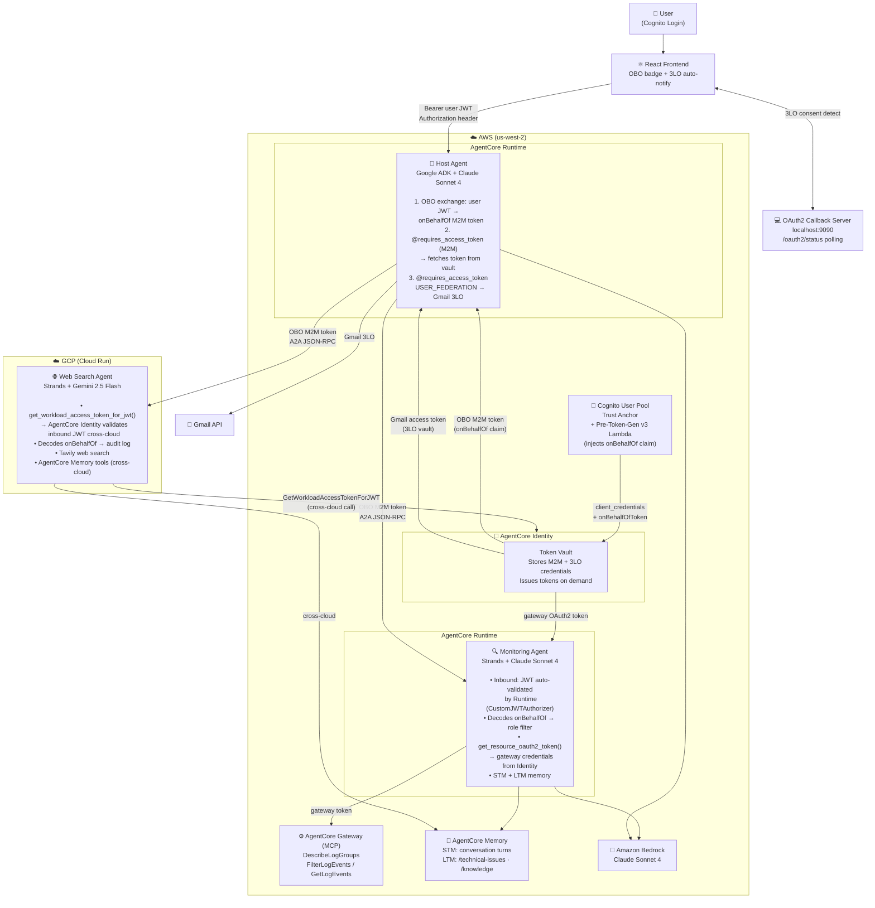

# 🤖 A2A Multi-Agent Incident Response on Amazon Bedrock AgentCore

> **Note**: This is an educational sample demonstrating multi-cloud A2A agent orchestration with AgentCore Identity. It is not intended for production use without additional security hardening.

A **multi-cloud** implementation of the [Agent-to-Agent (A2A)](https://a2a-protocol.org/latest/) protocol — three specialized agents across AWS and GCP, coordinating in real time to investigate AWS infrastructure incidents, surface remediation steps, and deliver findings by email. A single Cognito User Pool is the trust anchor for all M2M and user-delegated identity across both clouds.

## 🎬 Demo


## Why This Matters

Enterprise AI doesn't live in one cloud or one vendor's ecosystem. This project shows how to build a multi-agent system that:

- **Uses the best model for each job** — Claude on Bedrock for AWS-aware reasoning, Gemini on GCP for web search. No lock-in.
- **Spans clouds without sharing secrets** — AWS and GCP agents authenticate via cryptographically verifiable JWT tokens from a single identity provider. No VPC peering, no static credentials, no network-level trust.
- **Propagates user identity end-to-end** — The user who logged in is visible to every downstream agent via the `onBehalfOf` OBO claim. Audit logs say "alice@demo.com (admin) asked this" — not just "the agent did it."
- **Enforces role-based access without a policy engine** — Role filtering is applied at the agent layer: alice (admin) sees all CloudWatch logs, bob (manager) sees only Lambda and API Gateway, charlie (analyst) sees only Lambda.
- **Uses open protocols** — A2A (JSON-RPC 2.0) for agent-to-agent communication, MCP for tool access. Agents from different frameworks (Google ADK, Strands) collaborate without custom integration code.

## 🏗️ Architecture



### Identity Flow

```
User logs in (Cognito)
  → Frontend sends user JWT as Authorization header to Host Agent
    → Host Agent calls Cognito /oauth2/token with onBehalfOfToken = user JWT
      → Pre-Token-Gen Lambda injects {email, sub} into onBehalfOf claim
        → OBO M2M token forwarded to Monitor + WebSearch agents
          → Each agent decodes onBehalfOf → applies role-based policy
            → Audit metadata embedded as <!--AUDIT:{...}--> in response artifact text
              → Frontend (ChatMessage.tsx) strips marker, renders "On behalf of: alice@demo.com (admin)" badge
```

### Role-Based Access

| User | Role | CloudWatch access |
|---|---|---|
| alice@demo.com | admin | All log groups |
| bob@demo.com | manager | `/aws/lambda/` + API Gateway only |
| charlie@demo.com | analyst | `/aws/lambda/` only |
| anyone else | viewer | Blocked — no access |

## 🧩 Agents

| Agent | Framework | Runtime | Model | Key Features |
|---|---|---|---|---|
| **Host Agent** | Google ADK | AWS AgentCore Runtime | Claude Sonnet 4 (Bedrock) | OBO token exchange, A2A orchestration, Gmail 3LO |
| **Monitoring Agent** | Strands SDK | AWS AgentCore Runtime | Claude Sonnet 4 (Bedrock, configurable via `MODEL_ID`) | CloudWatch via MCP Gateway, role filtering, STM+LTM memory |
| **Web Search Agent** | Strands SDK | GCP Cloud Run | Gemini 2.5 Flash (LiteLLM) | Tavily search, Cognito JWT middleware, memory tools |

## ✅ Prerequisites

### AWS
- Active AWS account in `us-west-2`
- AWS CLI configured: `aws configure set region us-west-2`
- Bedrock model access enabled for Claude Sonnet 4 and 4.5

### GCP (for Web Search Agent)
- GCP project with billing enabled
- `gcloud` CLI authenticated
- Cloud Run, Cloud Build APIs enabled

### Tools
- Python 3.13+
- [uv](https://docs.astral.sh/uv/getting-started/installation/) package manager
- Docker (for local builds)

### API Keys
- **Google API Key** — [Google AI Studio](https://aistudio.google.com/app/apikey) (Gemini for web search agent)
- **Tavily API Key** — [tavily.com](https://tavily.com/) (web search)

### Gmail 3LO (optional — for email findings feature)
- Google OAuth 2.0 client ID + secret from [Google Cloud Console](https://console.developers.google.com/)
- Gmail API enabled, test users added to OAuth consent screen

## 🚀 Quick Start

```bash
git clone https://github.com/rajolishruthi/agentcore-samples.git
cd 02-use-cases/A2A-multi-agent-incident-response

# Deploy all AWS stacks interactively
uv run deploy.py
```

The script deploys in order: Cognito → Monitoring Agent → Host Agent (~10-15 minutes total).

Then deploy the Web Search Agent to GCP — see [DEPLOY_MULTICLOUD.md](./DEPLOY_MULTICLOUD.md).

## 🖥️ Frontend

```bash
cd frontend
npm install
chmod +x ./setup-env.sh && ./setup-env.sh
npm run dev
```

For Gmail 3LO (email findings), also start the OAuth2 callback server:

```bash
uv run host_adk_agent/oauth2_callback_server.py --region us-west-2
```

The frontend polls `localhost:9090/oauth2/status` after displaying a Gmail auth URL and automatically retries the email request when consent is granted — no manual "access is granted" message needed.

## 🔑 Bearer Tokens

Get M2M tokens for direct agent testing or the A2A Inspector:

```bash
# Monitoring agent
uv run monitoring_strands_agent/scripts/get_m2m_token.py

# Web search agent
uv run web_search_strands_agent/scripts/get_m2m_token.py

# Host agent (uses Cognito username/password)
uv run host_adk_agent/scripts/get_m2m_token.py
```

## 🧪 Test Scripts

```bash
# Test individual agents interactively
uv run test/connect_agent.py --agent monitor
uv run test/connect_agent.py --agent websearch
uv run test/connect_agent.py --agent host
```

## 🔍 Debugging Tools

### ADK Web UI
```bash
adk web   # from the project root
```
See [ADK Web](https://github.com/google/adk-web) for setup.

### A2A Inspector
1. Install [A2A Inspector](https://github.com/a2aproject/a2a-inspector)
2. Get a bearer token (above)
3. Add headers: `Authorization`, `X-Amzn-Bedrock-AgentCore-Runtime-Session-Id` (min 32 chars), `X-Amzn-Bedrock-AgentCore-Runtime-Custom-Actorid`

## 📁 Project Structure

```
A2A-multi-agent-incident-response/
├── cloudformation/
│   ├── cognito.yaml              # Cognito User Pool + OBO client + Pre-Token-Gen Lambda
│   ├── host_agent.yaml           # Host Agent AgentCore Runtime
│   ├── monitoring_agent.yaml     # Monitoring Agent AgentCore Runtime + MCP Gateway
│   └── lambdas/
│       └── pre_token_gen.py      # Copies user identity into onBehalfOf JWT claim
├── host_adk_agent/
│   ├── agent.py                  # Root agent, OBO A2A client factory (_OBOAuth)
│   ├── main.py                   # AgentCore entrypoint, extracts user JWT
│   ├── obo_token.py              # OBO token exchanger with single-flight cache
│   ├── email_tool.py             # Gmail 3LO send-email tool
│   ├── oauth2_callback_server.py # Local callback server + /oauth2/status polling endpoint
│   └── prompt/__init__.py        # Delegation rules (monitor / websearch / email)
├── monitoring_strands_agent/
│   ├── agent.py                  # Strands agent + MCP Gateway connection
│   ├── agent_executor.py         # OBO decode, role filtering, streaming
│   ├── obo_claims.py             # Role map + log group prefix filter
│   └── memory_hook.py            # Auto STM save + LTM retrieval via Strands hooks
├── web_search_strands_agent/     # GCP Cloud Run deployment
│   ├── agent.py                  # Strands agent + Tavily + memory tools
│   ├── agent_executor.py         # OBO decode for audit, streaming
│   ├── agentcore_identity_auth.py # Cognito JWT validation via GetWorkloadAccessTokenForJWT
│   ├── obo_claims.py             # Decode onBehalfOf for audit metadata
│   └── deploy.sh                 # GCP Cloud Run deployment script
├── frontend/                     # React + Vite + AWS Amplify
│   └── src/
│       ├── hooks/useChat.tsx      # Streaming, OBO badge, 3LO auto-notify polling
│       └── components/
│           ├── ChatMessage.tsx    # OBO badge, transfer block, metadata panel
│           └── ChatContainer.tsx  # Auth session, agent init
├── test/
│   └── connect_agent.py          # Interactive CLI for all three agents
├── deploy.py                     # Interactive deployment script
├── cleanup.py                    # Automated resource cleanup
├── DEPLOY_MULTICLOUD.md          # GCP Cloud Run deployment guide
└── DEMO_TEST_CASES.md            # Frontend test cases for demo users
```

## 🔒 Security Considerations

This sample is for educational purposes. Before production use, address:

- **IAM policies** — scope down to least-privilege (current policies use broad `*` resources in several places)
- **OBO client secret** — stored in Secrets Manager; rotate regularly
- **Cognito domain** — use a custom domain in production
- **GCP static credentials** — replace with Workload Identity Federation (see [DEPLOY_MULTICLOUD.md](./DEPLOY_MULTICLOUD.md))
- **CORS** — `oauth2_callback_server.py` allows `localhost` origins; lock down for production

## 🧹 Cleanup

```bash
# AWS resources
uv run cleanup.py

# GCP
gcloud run services delete web-search-strands-agent --region us-central1
```

> [!WARNING]
> Cleanup permanently deletes all deployed resources including the Cognito User Pool, AgentCore Runtimes, ECR images, and S3 bucket. This cannot be undone.

## 📚 Related Docs

| Document | Purpose |
|---|---|
| [DEPLOY_MULTICLOUD.md](./DEPLOY_MULTICLOUD.md) | Step-by-step GCP Cloud Run deployment |
| [DEMO_TEST_CASES.md](./DEMO_TEST_CASES.md) | Frontend test cases for Alice (admin) and Bob (manager) |
| [host_adk_agent/AGENT_DOC.md](./host_adk_agent/AGENT_DOC.md) | Host agent internals, OBO flow, 3LO |
| [monitoring_strands_agent/AGENT_DOC.md](./monitoring_strands_agent/AGENT_DOC.md) | Monitoring agent internals, memory hooks, role filtering |
| [web_search_strands_agent/AGENT_DOC.md](./web_search_strands_agent/AGENT_DOC.md) | Web search agent internals, cross-cloud auth, memory tools |

## 📄 License

MIT-0 — see [LICENSE](../../LICENSE)
