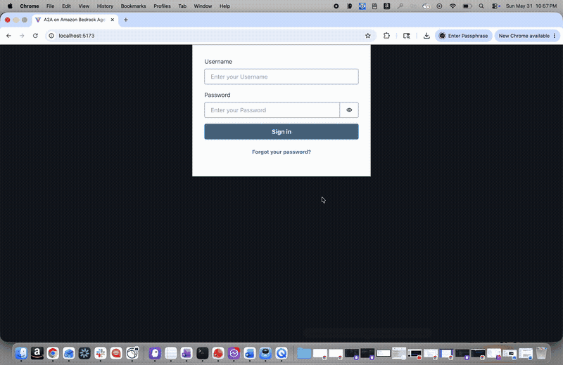
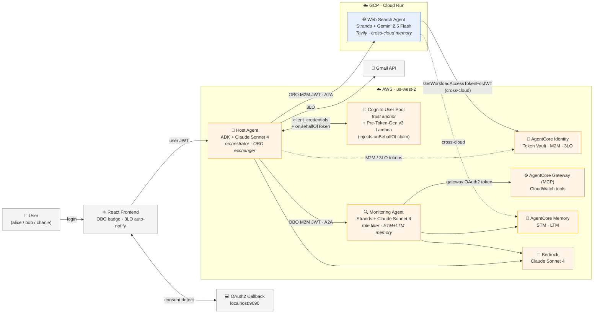
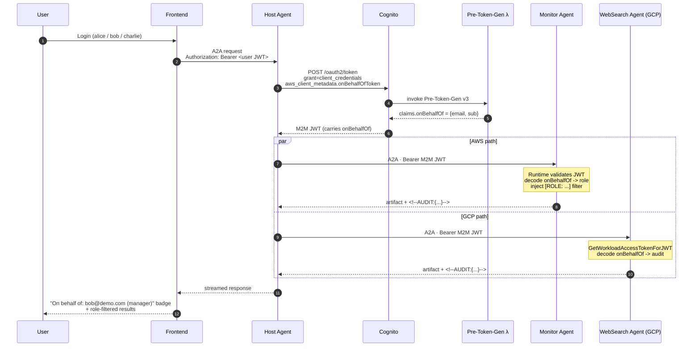

# A2A Multi-Agent Incident Response on Amazon Bedrock AgentCore

> **Note**: This is an educational sample demonstrating multi-cloud A2A agent orchestration with AgentCore Identity. It is not intended for production use without additional security hardening.

A **multi-cloud** implementation of the [Agent-to-Agent (A2A)](https://a2a-protocol.org/latest/) protocol, three specialized agents across AWS and GCP, coordinating in real time to investigate AWS infrastructure incidents, surface remediation steps, and deliver findings by email. A single Cognito User Pool is the trust anchor for all M2M and user-delegated identity across both clouds.

A **monitoring agent** ([Strands SDK](https://strandsagents.com/latest/), Claude Sonnet 4 on Bedrock) answers CloudWatch logs and metrics questions through an AgentCore MCP Gateway, with role-based filtering applied per user: admins see all log groups, managers see Lambda + API Gateway, analysts see Lambda only. A **web search agent** (Strands SDK, Gemini 2.5 Flash) runs on **GCP Cloud Run** and finds remediation strategies via Tavily; inbound Cognito JWTs are validated cross-cloud through AgentCore Identity's `GetWorkloadAccessTokenForJWT` API. Both run as independent A2A servers and use AgentCore primitives: Memory for STM/LTM, Identity for inbound JWT validation and outbound token vaulting, Gateway for tool access. They're coordinated by a **host agent** ([Google ADK](https://google.github.io/adk-docs/), Claude Sonnet 4 on Bedrock) on its own AgentCore Runtime, which exchanges the user's Cognito JWT for an `onBehalfOf` M2M token via a Cognito-native pattern (Pre-Token-Generation v3 Lambda + `aws_client_metadata.onBehalfOfToken`) and sends incident findings via Gmail using AgentCore Identity's 3LO flow.

## 🎬 Demo



## Why This Matters

Multi-agent systems span cloud boundaries, your Bedrock-hosted agent may invoke a tool on another cloud or on-prem. Traditional network-level trust (VPC peering, VPNs, IP whitelisting) is antithetical to zero-trust and impossible across organizational lines. AgentCore Identity provides identity-based trust that can be verified anywhere: **the network topology is irrelevant, the identity is everything.**

- **Built on AgentCore Identity end-to-end**, inbound JWT validation on AgentCore Runtime (AWS) and `GetWorkloadAccessTokenForJWT` (GCP), the Token Vault for outbound M2M and 3LO credentials, `@requires_access_token` for transparent token retrieval, and `get_resource_oauth2_token` for MCP Gateway access. One identity primitive, every hop.
- **Uses the best model for each job**, Claude on Bedrock for AWS-aware reasoning, Gemini on GCP for web search. No lock-in.
- **Spans clouds without sharing secrets**, AWS and GCP agents authenticate via cryptographically verifiable Cognito JWTs. No VPC peering, no static credentials, no network-level trust, just signed tokens validated through AgentCore Identity.
- **Propagates user identity end-to-end via Cognito-native OBO**, because Cognito doesn't implement RFC 8693, `ON_BEHALF_OF_TOKEN_EXCHANGE` isn't an option. Instead, a Pre-Token-Generation v3 Lambda copies the user's identity into a custom `onBehalfOf` claim during a `client_credentials` exchange. Audit logs say "alice@demo.com (admin) asked this", not "the agent did it."
- **Enforces role-based access at the agent layer**, alice (admin) sees all CloudWatch logs, bob (manager) sees Lambda + API Gateway, charlie (analyst) sees Lambda only. The `onBehalfOf` claim drives the filter, no policy engine, no extra service.
- **Uses open protocols**, A2A (JSON-RPC 2.0) for agent-to-agent, MCP for tool access. Google ADK and Strands SDK agents collaborate without custom integration code.

## 🏗️ Architecture

Identity is the trust boundary. Cognito is the only secret-free trust anchor; every hop across AWS and GCP is a cryptographically verifiable JWT. There are no shared static credentials, no VPC peering, and no network-level trust between clouds.



### Request Flow: OBO + Role-Based Filtering



### Role-Based Access

| User | Role | CloudWatch access |
|---|---|---|
| alice@demo.com | admin | All log groups |
| bob@demo.com | manager | `/aws/lambda/` + API Gateway only |
| charlie@demo.com | analyst | `/aws/lambda/` only |
| anyone else | viewer | Blocked, no access |

## 🧩 Agents

| Agent | Framework | Runtime | Model | Key Features |
|---|---|---|---|---|
| **Host Agent** | Google ADK | AWS AgentCore Runtime | Claude Sonnet 4 (Bedrock) | OBO token exchange, A2A orchestration, Gmail 3LO |
| **Monitoring Agent** | Strands SDK | AWS AgentCore Runtime | Claude Sonnet 4 (Bedrock, configurable via `MODEL_ID`) | CloudWatch via MCP Gateway, role filtering, STM+LTM memory |
| **Web Search Agent** | Strands SDK | GCP Cloud Run | Gemini 2.5 Flash (LiteLLM) | Tavily search, Cognito JWT middleware, memory tools |

> [!NOTE]
> **Default Models**
>
> - **Host Agent (ADK)**: `global.anthropic.claude-sonnet-4-20250514-v1:0` via `BEDROCK_MODEL_ID` (Bedrock). Falls back to `gemini-2.5-flash` if unset.
> - **Monitoring Agent (Strands)**: `global.anthropic.claude-sonnet-4-20250514-v1:0` via `MODEL_ID` (Bedrock).
> - **Web Search Agent (Strands)**: `gemini-2.5-flash` (Gemini API via LiteLLM).
>
> Override at deploy time via the prompts in `deploy.py` or the corresponding env vars.

## 🤝 What is A2A?

<details>
<summary>Agent-to-Agent (A2A) protocol</summary>

[A2A](https://a2a-protocol.org/latest/) is an open standard for agent interoperability. It defines:

- **Agent discovery**: `/.well-known/agent-card.json` describes capabilities and skills
- **Communication**: JSON-RPC 2.0 over HTTP
- **Authentication**: OAuth 2.0 bearer tokens
- **Framework-agnostic**: Google ADK, Strands, OpenAI Agents SDK, etc. can all speak it

AgentCore Runtime hosts A2A servers natively; JWT validation, agent card endpoint, scaling, and observability are all handled by the platform. The agents in this sample run on three different runtimes (two on AgentCore in AWS, one on Cloud Run in GCP) and interoperate purely through A2A.

</details>

## ✅ Prerequisites

### AWS
- Active AWS account in `us-west-2`
- AWS CLI configured: `aws configure set region us-west-2`
- Bedrock model access enabled for Claude Sonnet 4 and 4.5

### GCP (for Web Search Agent)
- GCP project with billing enabled
- `gcloud` CLI authenticated
- Cloud Run, Cloud Build APIs enabled

### Tools
- Python 3.13+
- [uv](https://docs.astral.sh/uv/getting-started/installation/) package manager
- Docker (for local builds)

### API Keys
- **Google API Key**: [Google AI Studio](https://aistudio.google.com/app/apikey) (Gemini for web search agent)
- **Tavily API Key**: [tavily.com](https://tavily.com/) (web search)

### Gmail 3LO (optional, for email findings feature)
- Google OAuth 2.0 client ID + secret from [Google Cloud Console](https://console.developers.google.com/)
- Gmail API enabled, test users added to OAuth consent screen

## 🚀 Quick Start

```bash
git clone https://github.com/rajolishruthi/agentcore-samples.git
cd 02-use-cases/A2A-multi-agent-incident-response

# Deploy all AWS stacks interactively
uv run deploy.py
```

The script deploys in order: Cognito -> Monitoring Agent -> Host Agent (~10-15 minutes total).

Then deploy the Web Search Agent to GCP, see [DEPLOY_MULTICLOUD.md](./DEPLOY_MULTICLOUD.md).

## 🖥️ Frontend

```bash
cd frontend
npm install
chmod +x ./setup-env.sh && ./setup-env.sh
npm run dev
```

For Gmail 3LO (email findings), also start the OAuth2 callback server:

```bash
uv run host_adk_agent/oauth2_callback_server.py --region us-west-2
```

The frontend polls `localhost:9090/oauth2/status` after displaying a Gmail auth URL and automatically retries the email request when consent is granted, no manual "access is granted" message needed.

## 🔑 Bearer Tokens

Get M2M tokens for direct agent testing or the A2A Inspector:

```bash
# Monitoring agent
uv run monitoring_strands_agent/scripts/get_m2m_token.py

# Web search agent
uv run web_search_strands_agent/scripts/get_m2m_token.py

# Host agent (uses Cognito username/password)
uv run host_adk_agent/scripts/get_m2m_token.py
```

## 🧪 Test Scripts

```bash
# Test individual agents interactively
uv run test/connect_agent.py --agent monitor
uv run test/connect_agent.py --agent websearch
uv run test/connect_agent.py --agent host
```

## 🔍 Debugging Tools

### ADK Web UI
```bash
adk web   # from the project root
```
See [ADK Web](https://github.com/google/adk-web) for setup.

### A2A Inspector
1. Install [A2A Inspector](https://github.com/a2aproject/a2a-inspector)
2. Get a bearer token (above)
3. Add headers: `Authorization`, `X-Amzn-Bedrock-AgentCore-Runtime-Session-Id` (min 32 chars), `X-Amzn-Bedrock-AgentCore-Runtime-Custom-Actorid`

## 📁 Project Structure

```
A2A-multi-agent-incident-response/
├── cloudformation/
│   ├── cognito.yaml              # Cognito User Pool + OBO client + Pre-Token-Gen Lambda
│   ├── host_agent.yaml           # Host Agent AgentCore Runtime
│   ├── monitoring_agent.yaml     # Monitoring Agent AgentCore Runtime + MCP Gateway
│   └── lambdas/
│       └── pre_token_gen.py      # Copies user identity into onBehalfOf JWT claim
├── host_adk_agent/
│   ├── agent.py                  # Root agent, OBO A2A client factory (_OBOAuth)
│   ├── main.py                   # AgentCore entrypoint, extracts user JWT
│   ├── obo_token.py              # OBO token exchanger with single-flight cache
│   ├── email_tool.py             # Gmail 3LO send-email tool
│   ├── oauth2_callback_server.py # Local callback server + /oauth2/status polling endpoint
│   └── prompt/__init__.py        # Delegation rules (monitor / websearch / email)
├── monitoring_strands_agent/
│   ├── agent.py                  # Strands agent + MCP Gateway connection
│   ├── agent_executor.py         # OBO decode, role filtering, streaming
│   ├── obo_claims.py             # Role map + log group prefix filter
│   └── memory_hook.py            # Auto STM save + LTM retrieval via Strands hooks
├── web_search_strands_agent/     # GCP Cloud Run deployment
│   ├── agent.py                  # Strands agent + Tavily + memory tools
│   ├── agent_executor.py         # OBO decode for audit, streaming
│   ├── agentcore_identity_auth.py # Cognito JWT validation via GetWorkloadAccessTokenForJWT
│   ├── obo_claims.py             # Decode onBehalfOf for audit metadata
│   └── deploy.sh                 # GCP Cloud Run deployment script
├── frontend/                     # React + Vite + AWS Amplify
│   └── src/
│       ├── hooks/useChat.tsx      # Streaming, OBO badge, 3LO auto-notify polling
│       └── components/
│           ├── ChatMessage.tsx    # OBO badge, transfer block, metadata panel
│           └── ChatContainer.tsx  # Auth session, agent init
├── test/
│   └── connect_agent.py          # Interactive CLI for all three agents
├── deploy.py                     # Interactive deployment script
├── cleanup.py                    # Automated resource cleanup
├── DEPLOY_MULTICLOUD.md          # GCP Cloud Run deployment guide
└── DEMO_GUIDE.md                 # Demo walkthrough + talking points
```

## 🔬 Identity & Zero-Trust

### Five Layers of Zero-Trust Identity

| Layer | What | Where in Code |
|---|---|---|
| 1. Inbound Auth (AWS) | AgentCore Runtime validates Cognito JWTs via `CustomJWTAuthorizer` before agent code runs. Allowed-client lists per agent. | `cloudformation/monitoring_agent.yaml`, `cloudformation/host_agent.yaml` |
| 2. Inbound Auth (Cross-Cloud) | On GCP where AgentCore Runtime isn't available, `GetWorkloadAccessTokenForJWT` validates the same Cognito JWT. Same trust model, different compute. | `web_search_strands_agent/agentcore_identity_auth.py` |
| 3. Outbound Tool Auth | Monitor agent's workload identity is exchanged for an MCP Gateway OAuth2 token via `get_resource_oauth2_token`. No static credentials in code. | `monitoring_strands_agent/utils.py` |
| 4. Outbound 3LO (Token Vaulting) | Gmail send uses `@requires_access_token(auth_flow="USER_FEDERATION")`. First call returns consent URL; the Token Vault stores access + refresh tokens for subsequent calls. | `host_adk_agent/email_tool.py` |
| 5. Delegated User Identity (OBO) | Host agent exchanges its M2M token with the user's JWT attached. Downstream agents read `onBehalfOf` from the inbound bearer and apply role-based policy. | `host_adk_agent/obo_token.py`, `monitoring_strands_agent/obo_claims.py`, `web_search_strands_agent/obo_claims.py` |

Whether an agent runs on AWS AgentCore Runtime or GCP Cloud Run, the trust model is the same: cryptographically verifiable JWT tokens issued by a central identity provider. The infrastructure layer changes, but the identity verification is consistent. No VPC peering. No shared secrets. No network-level trust. Just identity.

### How OBO Works (Cognito-Native)

Multi-agent systems hit a common problem: the agent that finally does the work has lost the user's identity. The downstream call is M2M, so audit logs say "the agent did it" instead of "the agent did it on behalf of alice@demo.com." This sample fixes that with a Cognito-native OBO flow.

**Why not `ON_BEHALF_OF_TOKEN_EXCHANGE`?** AgentCore Identity's built-in OBO API requires an OAuth2 IdP that implements RFC 8693 token exchange or RFC 7523 §2.1 JWT bearer grant. Cognito implements neither. The supported out-of-the-box providers are Microsoft Entra ID and any custom RFC-compliant IdP. We use Cognito's Pre-Token-Generation feature to achieve the same outcome on the existing identity provider.

**Mechanism.** The host agent calls `POST /oauth2/token` on the Cognito domain with `grant_type=client_credentials` and the user's JWT in `aws_client_metadata`:

```python
aws_client_metadata = {
    "onBehalfOfToken": "<incoming user JWT>",
    "callerApp": "host-agent",
}
```

A Pre-Token-Generation v3 Lambda fires on token issuance, decodes the user JWT from `clientMetadata.onBehalfOfToken`, and returns a custom `onBehalfOf` claim under `claimsAndScopeOverrideDetails.accessTokenGeneration.claimsToAddOrOverride`. The agent's M2M token now carries the user's identity. Downstream agents read it from the inbound bearer (no extra hop, no extra IdP) and apply role-based policy: alice -> admin, bob -> manager, charlie -> analyst, default -> viewer.

**Trust boundary.** The user JWT itself never leaves the host agent. Only the host's exchanged M2M token, signed by Cognito and carrying the `onBehalfOf` claim, flows downstream. Downstream agents trust the claim because Layers 1 and 2 already validated the token signature.

| Code | Purpose |
|---|---|
| `cloudformation/lambdas/pre_token_gen.py` | Pre-Token-Gen v3 handler that copies user identity into `onBehalfOf` |
| `host_adk_agent/obo_token.py` | Async OBO token exchanger with single-flight cache |
| `host_adk_agent/agent.py` (`_OBOAuth(httpx.Auth)`) | Per-request bearer injection for outbound A2A calls |
| `monitoring_strands_agent/obo_claims.py` | Role map + CloudWatch result filtering by role |
| `web_search_strands_agent/obo_claims.py` | Decode `onBehalfOf` from inbound bearer for audit logging |
| `frontend/src/components/ChatMessage.tsx` | "On behalf of: alice@demo.com (admin)" badge per agent response |

### Other Implementation Notes

- **Identity propagation header**: `requestHeaderConfiguration.requestHeaderAllowlist` on the host agent runtime explicitly allowlists `Authorization` so the inbound user JWT reaches the agent. Without this, AgentCore strips it.
- **Role-based filtering**: monitor agent decodes `onBehalfOf`, looks up the role, and prepends `[ROLE: ...] You may ONLY return results where log group names start with: ...` to the user message. The LLM applies the filter; admins pass through unchanged. (`monitoring_strands_agent/agent_executor.py`, `obo_claims.py`)
- **A2A static cards**: each agent serves `/.well-known/agent-card.json`. The host agent uses lazy-resolved `RemoteA2aAgent` so card resolution happens once per session.
- **Audit metadata**: downstream agents append `<!--AUDIT:{...}-->` to artifact text. `frontend/src/components/ChatMessage.tsx` strips the marker and renders the "On behalf of: <email> (role)" badge.

## 🔒 Security Considerations

This sample is for educational purposes. Before production use, address:

- **IAM policies**: scope down to least-privilege (current policies use broad `*` resources in several places)
- **OBO client secret**: stored in Secrets Manager; rotate regularly
- **Cognito domain**: use a custom domain in production
- **GCP static credentials**: replace with Workload Identity Federation (see [DEPLOY_MULTICLOUD.md](./DEPLOY_MULTICLOUD.md))
- **CORS**: `oauth2_callback_server.py` allows `localhost` origins; lock down for production

## 🧹 Cleanup

```bash
# AWS resources
uv run cleanup.py

# GCP
gcloud run services delete web-search-strands-agent --region us-central1
```

> [!WARNING]
> Cleanup permanently deletes all deployed resources including the Cognito User Pool, AgentCore Runtimes, ECR images, and S3 bucket. This cannot be undone.

## 📚 Related Docs

| Document | Purpose |
|---|---|
| [DEPLOY_MULTICLOUD.md](./DEPLOY_MULTICLOUD.md) | Step-by-step GCP Cloud Run deployment |
| [DEMO_GUIDE.md](./DEMO_GUIDE.md) | Demo walkthrough · talking points · per-role test prompts |
| [host_adk_agent/AGENT_DOC.md](./host_adk_agent/AGENT_DOC.md) | Host agent internals, OBO flow, 3LO |
| [monitoring_strands_agent/AGENT_DOC.md](./monitoring_strands_agent/AGENT_DOC.md) | Monitoring agent internals, memory hooks, role filtering |
| [web_search_strands_agent/AGENT_DOC.md](./web_search_strands_agent/AGENT_DOC.md) | Web search agent internals, cross-cloud auth, memory tools |

## 📄 License

MIT-0, see [LICENSE](../../LICENSE)
