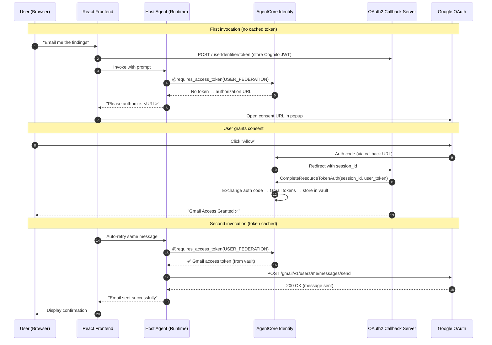

# AgentCore Identity — Cross-Cloud Authentication Guide

## Overview

This document explains how AgentCore Identity secures communication between agents in the A2A multi-agent incident response system, specifically:

- Host Agent (AWS) → Monitor Agent (AWS AgentCore Runtime) — **M2M**
- Host Agent (AWS) → Web Search Agent (GCP Cloud Run) — **M2M (cross-cloud)**
- Host Agent (AWS) → Gmail API (on behalf of user) — **3LO (Authorization Code Grant)**

All flows use the same trust anchor (Cognito) but different mechanisms depending on the target and whether user consent is required.

---

## What We're Doing with A2A

The A2A (Agent-to-Agent) protocol is an open standard for agents to communicate with each other regardless of framework or hosting. In our system:

- A **Host Agent** (Google ADK) orchestrates incident response by delegating to specialist agents
- A **Monitor Agent** (Strands SDK) queries CloudWatch for logs, metrics, and alarms
- A **Web Search Agent** (Strands SDK) searches the web for AWS documentation and solutions

These agents run on different infrastructure (AWS AgentCore Runtime and GCP Cloud Run) and are built with different frameworks, but communicate via A2A's JSON-RPC protocol. Each agent publishes an **agent card** (at `/.well-known/agent-card.json`) describing its capabilities, and the host agent discovers and delegates to them.

The challenge: **How does the web search agent on GCP verify that the caller is legitimate?** There's no AgentCore Runtime in front of it to handle auth automatically.

---

## How We Use GetWorkloadAccessTokenForJWT

`GetWorkloadAccessTokenForJWT` is the key to securing the cross-cloud A2A call. It lets the GCP agent validate the incoming Bearer token by delegating the cryptographic verification to AgentCore Identity — the same service that would validate it on Runtime.

### The Complete Flow

```
┌─────────────────────────────────────────────────────────────────────────┐
│ 1. Host Agent needs to call Web Search Agent                            │
│                                                                         │
│    @requires_access_token(provider="AgentOAuth2Provider-web-search...")  │
│    → AgentCore Identity fetches Cognito M2M token from token vault      │
│    → Returns signed JWT (client_credentials grant)                      │
└────────────────────────────────────────┬────────────────────────────────┘
                                         │
                                         │ A2A request
                                         │ Authorization: Bearer <Cognito JWT>
                                         │
                                         ▼
┌─────────────────────────────────────────────────────────────────────────┐
│ 2. Web Search Agent (GCP Cloud Run) receives request                    │
│                                                                         │
│    AgentCoreIdentityMiddleware:                                          │
│    ├── Extract Bearer token from Authorization header                   │
│    ├── Call GetWorkloadAccessTokenForJWT(                                │
│    │       workloadName="web-search-agent",                             │
│    │       userToken=<the Bearer JWT>                                   │
│    │   )                                                                │
│    │                                                                    │
│    │   AgentCore Identity:                                              │
│    │   ├── Fetches JWKS from Cognito (via credential provider config)   │
│    │   ├── Verifies JWT signature (RS256)                               │
│    │   ├── Checks token expiry                                          │
│    │   ├── Checks issuer matches credential provider's discovery URL    │
│    │   └── If valid → returns workload access token                     │
│    │                                                                    │
│    ├── Token valid → request proceeds to agent                          │
│    └── Token invalid → 401 Unauthorized                                 │
└─────────────────────────────────────────────────────────────────────────┘
                                         │
                                         │ (token validated)
                                         ▼
┌─────────────────────────────────────────────────────────────────────────┐
│ 3. Agent executes                                                       │
│    ├── Searches web via Tavily API                                      │
│    ├── Accesses AgentCore Memory (via IAM credentials)                  │
│    └── Returns results via A2A response                                 │
└─────────────────────────────────────────────────────────────────────────┘
```

### Why This Works

1. **Same trust anchor** — Both the host agent (getting the token) and the GCP agent (validating it) rely on the same Cognito User Pool's JWKS keys
2. **No custom crypto** — AgentCore Identity handles JWKS fetching, key rotation, signature verification
3. **Equivalent to Runtime** — The same validation that `customJWTAuthorizer` does on Runtime, but called as an API from any compute
4. **Single API call** — Validates the token AND returns a workload access token for potential outbound use

### What GetWorkloadAccessTokenForJWT Proves

When the call succeeds, it proves:
- The Bearer token is a **valid JWT** (well-formed, not tampered with)
- It was **signed by Cognito** (signature matches the published JWKS)
- It has **not expired**
- It was issued by the **expected issuer** (matches the credential provider's discovery URL)
- The calling agent is **authorized** to invoke this workload

If any of these checks fail, AgentCore Identity returns an error and the middleware returns 401.

---

## Architecture

```
┌─────────────────────────────────────────────────────────────────────────────┐
│                         Cognito User Pool                                    │
│                    (Single Trust Anchor)                                      │
│                                                                              │
│  Issues M2M tokens via client_credentials grant                              │
│  Publishes JWKS for signature verification                                   │
└──────────────────────────────┬───────────────────────────────────────────────┘
                               │
              ┌────────────────┼────────────────┐
              │                │                │
              ▼                ▼                ▼
┌──────────────────┐  ┌───────────────┐  ┌──────────────────────────┐
│  Host Agent      │  │ Monitor Agent │  │ Web Search Agent         │
│  (Google ADK)    │  │ (Strands SDK) │  │ (Strands SDK)            │
│                  │  │               │  │                          │
│  AgentCore       │  │ AgentCore     │  │ GCP Cloud Run            │
│  Runtime (AWS)   │  │ Runtime (AWS) │  │ (cross-cloud)            │
│                  │  │               │  │                          │
│  Gets M2M tokens │  │ JWT validated │  │ JWT validated by         │
│  via @requires_  │  │ by Runtime's  │  │ GetWorkloadAccessToken   │
│  access_token    │  │ customJWT     │  │ ForJWT (AgentCore        │
│                  │  │ Authorizer    │  │ Identity API)            │
└──────────────────┘  └───────────────┘  └──────────────────────────┘
```

---

## Flow 1: Host Agent → Monitor Agent (Both on AWS)

```
Host Agent                          AgentCore Identity              Monitor Agent (Runtime)
    │                                      │                              │
    │ 1. @requires_access_token            │                              │
    │    (provider: monitor-agent)         │                              │
    │─────────────────────────────────────▶│                              │
    │                                      │                              │
    │ 2. Returns Cognito M2M JWT           │                              │
    │◀─────────────────────────────────────│                              │
    │                                      │                              │
    │ 3. A2A request + Bearer <JWT>        │                              │
    │─────────────────────────────────────────────────────────────────────▶│
    │                                      │                              │
    │                                      │  4. customJWTAuthorizer      │
    │                                      │     - Fetch JWKS from Cognito│
    │                                      │     - Verify RS256 signature │
    │                                      │     - Check expiry           │
    │                                      │     - Check allowedClients   │
    │                                      │     (all automatic,          │
    │                                      │      infrastructure-level)   │
    │                                      │                              │
    │                                      │  5. If valid → request       │
    │                                      │     reaches agent code       │
    │                                      │                              │
    │ 6. Response                          │                              │
    │◀─────────────────────────────────────────────────────────────────────│
```

**Key points:**
- AgentCore Runtime handles JWT validation automatically (zero auth code in the monitor agent)
- Configured via `customJWTAuthorizer` with discovery URL + allowed clients
- The monitor agent code never sees or validates the token

---

## Flow 2: Host Agent → Web Search Agent (AWS → GCP)

```
Host Agent                          AgentCore Identity              Web Search Agent (GCP)
    │                                      │                              │
    │ 1. @requires_access_token            │                              │
    │    (provider: websearch-agent)       │                              │
    │─────────────────────────────────────▶│                              │
    │                                      │                              │
    │ 2. Returns Cognito M2M JWT           │                              │
    │◀─────────────────────────────────────│                              │
    │                                      │                              │
    │ 3. A2A request + Bearer <JWT>        │                              │
    │─────────────────────────────────────────────────────────────────────▶│
    │                                      │                              │
    │                                      │  4. Middleware extracts JWT  │
    │                                      │                              │
    │                                      │  5. GetWorkloadAccessToken   │
    │                                      │◀────ForJWT(workloadName,     │
    │                                      │     userToken=<JWT>)         │
    │                                      │                              │
    │                                      │  6. AgentCore Identity:      │
    │                                      │     - Validates JWT signature│
    │                                      │     - Checks expiry          │
    │                                      │     - Checks issuer          │
    │                                      │     - Returns workload token │
    │                                      │─────────────────────────────▶│
    │                                      │                              │
    │                                      │  7. If valid → request       │
    │                                      │     proceeds to agent        │
    │                                      │                              │
    │ 8. Response                          │                              │
    │◀─────────────────────────────────────────────────────────────────────│
```

**Key points:**
- No AgentCore Runtime on GCP → agent must validate the token itself
- Uses `GetWorkloadAccessTokenForJWT` — a single API call that validates the JWT AND returns a workload access token
- This is the programmatic equivalent of what Runtime's `customJWTAuthorizer` does
- The workload access token can be used for outbound calls if needed

---

## Why GetWorkloadAccessTokenForJWT?

### The Problem

On GCP Cloud Run, there's no AgentCore Runtime to validate incoming tokens. The agent needs to verify that the caller (host agent) is legitimate.

### Options Considered

| Approach | Validates Token? | Pros | Cons |
|---|---|---|---|
| Manual JWT validation (PyJWT + JWKS) | ✅ Yes | No AWS dependency at request time | ~110 lines of custom code, manual JWKS caching |
| `GetWorkloadAccessTokenForUserId` | ❌ No | Simple, gives workload token | Doesn't validate the incoming JWT |
| `GetWorkloadAccessTokenForJWT` | ✅ Yes | Validates JWT + gives workload token in one call | Requires AWS API call per request |

### Why We Chose GetWorkloadAccessTokenForJWT

1. **Single call, dual purpose** — validates the incoming JWT AND returns a workload access token
2. **No custom crypto code** — AgentCore Identity handles JWKS fetching, signature verification, expiry checks
3. **Consistent trust model** — same validation logic as Runtime's `customJWTAuthorizer`, just called explicitly
4. **Workload token bonus** — the returned token can be used for outbound calls (MCP Gateway, third-party OAuth services)

---

## What's in the M2M Token?

The Cognito M2M token (client credentials grant) identifies the **application**, not a user:

```json
{
  "sub": "4drdno8g0ipv8bc2kgljgbrfjt",
  "token_use": "access",
  "scope": "...",
  "iss": "https://cognito-idp.us-west-2.amazonaws.com/us-west-2_qmRqEF2tI",
  "exp": 1777956670,
  "client_id": "4drdno8g0ipv8bc2kgljgbrfjt"
}
```

**No user identity** — just "I am this client, issued by this pool, valid until this time."

User context (actor_id) is passed as a separate header (`X-Amzn-Bedrock-AgentCore-Runtime-Custom-Actorid`) by the host agent.

---

## GetWorkloadAccessTokenForJWT vs GetWorkloadAccessTokenForUserId

| | `ForJWT` | `ForUserId` |
|---|---|---|
| **Input** | A JWT token | A user ID string |
| **Validates incoming token?** | ✅ Yes (signature, expiry, issuer) | ❌ No |
| **Trust model** | Cryptographic (verifies the JWT) | Trusts the caller's IAM credentials |
| **Returns** | Workload token (agent-scoped) | Workload token (agent + user scoped) |
| **Use when** | You need to validate an incoming token | You've already verified the user elsewhere |
| **Our use case** | GCP agent inbound auth | Not used (we need validation) |

### When to use ForUserId

The ECS blog post uses `ForUserId` because:
1. Their ALB already validates the user (via OIDC with Microsoft Entra ID)
2. They extract the verified user ID from the ALB-signed JWT
3. They tell AgentCore Identity "trust me, this is user X"

They couldn't use `ForJWT` due to a Microsoft Entra ID + ALB audience conflict (the token audience needed to be Microsoft Graph for ALB, but AgentCore needs it addressed to the app).

**This doesn't apply to us** — Cognito M2M tokens don't have this conflict.

---

## Workload Access Token — What It's For

After `GetWorkloadAccessTokenForJWT` validates the incoming JWT, it returns a **workload access token**. This token represents: "I am agent `web-search-agent`, and I've been authenticated."

### Current usage

Stored in `request.state.workload_access_token` — available but not actively used yet.

### Potential future uses

| Use Case | How |
|---|---|
| Call MCP Gateway from GCP | Pass workload token to gateway client |
| Get OAuth tokens for third-party services | `get_resource_oauth2_token(workloadIdentityToken=...)` |
| Call another A2A agent | Get a new M2M token via credential provider |

### Not used for Memory

AgentCore Memory uses IAM auth (SigV4), not workload tokens. The GCP agent accesses Memory via AWS credentials (access keys or Workload Identity Federation).

---

## Security Comparison

| Aspect | Monitor Agent (Runtime) | Web Search Agent (GCP) |
|---|---|---|
| **Inbound auth** | `customJWTAuthorizer` (automatic) | `GetWorkloadAccessTokenForJWT` (explicit) |
| **Who validates?** | AgentCore Runtime infrastructure | AgentCore Identity API |
| **Auth code in agent?** | Zero | ~50 lines (middleware) |
| **Token validated?** | ✅ Signature, expiry, issuer, audience | ✅ Signature, expiry, issuer |
| **Memory access** | IAM execution role | AWS access keys (or Workload Identity Federation) |
| **MCP Gateway access** | Workload token (from Runtime header) | Not used (tools are local) |
| **Trust anchor** | Cognito JWKS | Cognito JWKS (via AgentCore Identity) |

---

## Implementation

### Middleware Code (`agentcore_identity_auth.py`)

```python
class AgentCoreIdentityMiddleware(BaseHTTPMiddleware):
    async def dispatch(self, request, call_next):
        # Skip auth for health/discovery endpoints
        if request.url.path in {"/ping", "/.well-known/agent-card.json"}:
            return await call_next(request)

        # Extract Bearer token
        bearer_token = request.headers.get("Authorization", "")[7:]

        # Single call: validate JWT + get workload token
        response = client.get_workload_access_token_for_jwt(
            workloadName="web-search-agent",
            userToken=bearer_token,
        )

        # Token is valid — proceed
        request.state.workload_access_token = response["workloadAccessToken"]
        return await call_next(request)
```

### Required AWS Resources

| Resource | Name | Purpose |
|---|---|---|
| Workload Identity | `web-search-agent` | Identifies the GCP agent to AgentCore Identity |
| OAuth2 Credential Provider | `AgentOAuth2Provider-web-search-agent-a2a` | Used by host agent to GET the M2M token (not by GCP agent) |
| Cognito User Pool | `us-west-2_qmRqEF2tI` | Issues M2M tokens, publishes JWKS for validation |

### Environment Variables (GCP Cloud Run)

| Variable | Purpose |
|---|---|
| `AWS_REGION` | Region for AgentCore Identity API calls |
| `AGENTCORE_WORKLOAD_NAME` | Workload identity name (`web-search-agent`) |
| `AWS_ACCESS_KEY_ID` | AWS credentials for API calls |
| `AWS_SECRET_ACCESS_KEY` | AWS credentials for API calls |

---

## Summary

The key insight: **AgentCore Identity's `GetWorkloadAccessTokenForJWT` lets you replicate Runtime's inbound auth on any compute.** You pass the incoming JWT, AgentCore validates it, and you get a workload token back. One API call replaces ~110 lines of manual JWKS/JWT validation code, and you get the same trust model as agents running on AgentCore Runtime.


---

## Flow 3: Host Agent → Gmail API (3LO — User-Delegated Access)

This flow demonstrates the **Authorization Code Grant (3-Legged OAuth)** pattern, where the agent accesses a third-party service (Gmail) **on behalf of a specific user** with their explicit consent.

### Why 3LO?

M2M tokens identify the **agent** — they say "I am the host agent." But sending an email requires access to a **user's** Gmail account. The agent can't do this with its own credentials — it needs the user's permission.

3LO solves this: the user consents once, and AgentCore Identity stores the Gmail token in the Token Vault, bound to that user. Subsequent requests use the cached token automatically.

### The Complete Flow

```
┌─────────────────────────────────────────────────────────────────────────┐
│ 1. User asks: "Email me the findings at user@gmail.com"                 │
│                                                                         │
│    Host Agent calls send_email_to_user tool                             │
│    → @requires_access_token(auth_flow="USER_FEDERATION")                │
│    → AgentCore Identity checks Token Vault: no Gmail token for user     │
│    → Returns authorization URL via on_auth_url callback                 │
│    → NonBlockingPoller returns immediately (doesn't wait)               │
│    → Agent returns consent URL to user                                  │
└────────────────────────────────────────┬────────────────────────────────┘
                                         │
                                         ▼
┌─────────────────────────────────────────────────────────────────────────┐
│ 2. Frontend opens consent URL in popup                                  │
│                                                                         │
│    Browser → AgentCore Identity authorize endpoint                      │
│    → Redirects to Google OAuth consent screen                           │
│    → User clicks "Allow"                                                │
│    → Google sends auth code to AgentCore Identity callback              │
│    → AgentCore Identity stores auth code, redirects to callback server  │
└────────────────────────────────────────┬────────────────────────────────┘
                                         │
                                         ▼
┌─────────────────────────────────────────────────────────────────────────┐
│ 3. Callback server completes session binding                            │
│                                                                         │
│    GET /oauth2/callback?session_id=...                                  │
│    → Callback server calls CompleteResourceTokenAuth(                   │
│          session_uri=session_id,                                        │
│          user_identifier={userToken: cognito_jwt}                       │
│      )                                                                  │
│    → AgentCore Identity exchanges auth code for Gmail tokens            │
│    → Stores access_token + refresh_token in Token Vault                 │
│    → Bound to this specific user (identified by Cognito JWT)            │
└────────────────────────────────────────┬────────────────────────────────┘
                                         │
                                         ▼
┌─────────────────────────────────────────────────────────────────────────┐
│ 4. User asks again (or frontend auto-retries)                           │
│                                                                         │
│    Host Agent calls send_email_to_user tool                             │
│    → @requires_access_token(auth_flow="USER_FEDERATION")                │
│    → AgentCore Identity checks Token Vault: ✅ Gmail token found        │
│    → Returns access_token to the tool                                   │
│    → Tool calls Gmail API with Bearer token                             │
│    → Email sent successfully                                            │
└─────────────────────────────────────────────────────────────────────────┘
```

### Sequence Diagram



### Key Components

| Component | File | Role |
|---|---|---|
| Email tool | `host_adk_agent/email_tool.py` | `@requires_access_token(USER_FEDERATION)` + Gmail API call |
| Callback server | `host_adk_agent/oauth2_callback_server.py` | Handles Google redirect, calls `CompleteResourceTokenAuth` |
| Frontend (token store) | `frontend/src/services/chatService.ts` | Stores Cognito JWT in callback server before each agent call |
| Frontend (popup) | `frontend/src/components/ChatContainer.tsx` | Detects consent URL, opens popup, auto-retries after close |
| Credential provider | AgentCore Identity (`gmail-3lo-provider`) | GoogleOauth2 provider with Gmail send scope |

### Implementation Pattern (from tutorial 12)

```python
from bedrock_agentcore.identity.auth import requires_access_token
from bedrock_agentcore.services.identity import TokenPoller

class _NonBlockingPoller(TokenPoller):
    """Returns immediately — doesn't block waiting for consent."""
    async def poll_for_token(self) -> str:
        return ""

_auth_url_cache: dict = {}

def _on_auth_url(url: str) -> None:
    _auth_url_cache["url"] = url

@requires_access_token(
    provider_name="gmail-3lo-provider",
    auth_flow="USER_FEDERATION",
    scopes=["https://www.googleapis.com/auth/gmail.send"],
    on_auth_url=_on_auth_url,
    callback_url="http://localhost:9090/oauth2/callback",
    token_poller=_NonBlockingPoller(),
)
def _send_email(access_token: str = "") -> str:
    if not access_token:
        # First call — return consent URL
        return f"Please authorize: {_auth_url_cache.get('url', '')}"
    # Token available — send email
    ...
```

### Token Lifecycle

| Event | What happens | User impact |
|---|---|---|
| First call (no token) | Consent URL returned | User clicks, grants access once |
| Subsequent calls | Token returned from vault | Instant — no user interaction |
| Access token expires (~1 hour) | Identity uses refresh token silently | None — transparent |
| Refresh token revoked | New consent URL returned | User must re-authorize |

### Session Binding — Why It's Needed

The callback server exists to answer one question: **"Who completed this consent?"**

Without session binding, an attacker could:
1. Intercept the consent URL
2. Complete the OAuth flow themselves
3. Bind THEIR Gmail token to YOUR agent session

Session binding prevents this by requiring the callback server to prove the same user who initiated the request is the one who completed consent (via the stored Cognito JWT).

### Comparison: M2M vs 3LO

| | M2M (agent-to-agent) | 3LO (user-delegated) |
|---|---|---|
| **Who authenticates?** | The agent (as itself) | The user (via consent) |
| **User interaction?** | None | One-time consent popup |
| **Token represents** | "I am the host agent" | "User X granted me Gmail access" |
| **Use case** | Calling other agents/APIs | Accessing user's personal resources |
| **Cognito grant type** | `client_credentials` | `authorization_code` |
| **Token storage** | Per-agent | Per-user in Token Vault |
| **Example in project** | Host → Monitor Agent | Host → Gmail (send email) |

---

## Five Layers of Identity in This Project

| Layer | Pattern | Where | What it proves |
|---|---|---|---|
| **1. Inbound Auth (Runtime)** | `customJWTAuthorizer` | Host/Monitor agent Runtime config | Caller has a valid Cognito JWT |
| **2. Inbound Auth (Cross-Cloud)** | `GetWorkloadAccessTokenForJWT` | Web Search Agent middleware | Same validation, different compute |
| **3. Outbound Auth (M2M)** | `@requires_access_token(M2M)` | Host Agent → other agents | Agent authenticates as itself |
| **4. Outbound Auth (Tools - M2M)** | `get_resource_oauth2_token` | Monitor Agent → Gateway | Agent gets tool access token |
| **5. Outbound Auth (3LO)** | `@requires_access_token(USER_FEDERATION)` | Host Agent → Gmail | User explicitly grants access |
